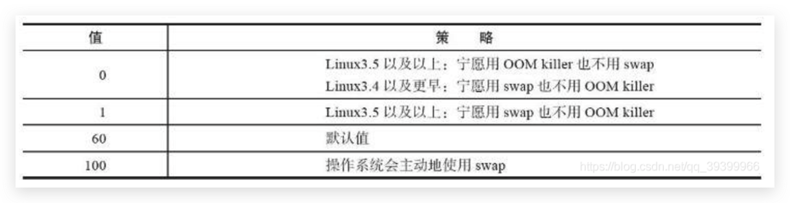

# Redis

[TOC]


## 1. Redis-cli 客户端

### 1.1. 连接集群 

`redis-cli -c -p 6382 -h 192.168.10.12` -a password

### 1.2.查看内存

`info memory`

## 2. 数据类型

### 2.1.String 字符串

#### SET

- SET key value [expiration EX seconds|PX milliseconds] [NX|XX]

  - `EX seconds` ： 将键的过期时间设置为 `seconds` 秒。 执行 `SET key value EX seconds` 的效果等同于执行 `SETEX key seconds value` 。
  - `PX milliseconds` ： 将键的过期时间设置为 `milliseconds` 毫秒。 执行 `SET key value PX milliseconds` 的效果等同于执行 `PSETEX key milliseconds value` 。
  - `NX` ： 只在键不存在时， 才对键进行设置操作。 执行 `SET key value NX` 的效果等同于执行 `SETNX key value` 。
  - `XX` ： 只在键已经存在时， 才对键进行设置操作。

#### SETNX
- SETNX key value

  - 只在键 `key` 不存在的情况下， 将键 `key` 的值设置为 `value` 。

  - 若键 `key` 已经存在， 则 `SETNX` 命令不做任何动作。
- APPEND key value

  将一个`value`连接到另一个`key`的值的尾部。

#### SETEX
- SETEX key seconds value

  - 将键 `key` 的值设置为 `value` ， 并将键 `key` 的生存时间设置为 `seconds` 秒钟。

  - 如果键 `key` 已经存在， 那么 `SETEX` 命令将覆盖已有的值。

#### PSETEX
- PSETEX key milliseconds value

  将键 `key` 的值设置为 `value` ， 并将键 `key` 的生存时间设置为 `milliseconds ` 毫秒钟。

  如果键 `key` 已经存在， 那么 `PSETEX ` 命令将覆盖已有的值。

#### DECR
- DECR key

  - 为键 `key` 储存的数字值减去一。

  - 如果键 `key` 不存在， 那么键 `key` 的值会先被初始化为 `0` ， 然后再执行 `DECR` 操作。

  - 如果键 `key` 储存的值不能被解释为数字， 那么 `DECR` 命令将返回一个错误。

  - 本操作的值限制在 64 位(bit)有符号数字表示之内。

#### DECRBY
- DECRBY key decrement

  - 将键 `key` 储存的整数值减去减量 `decrement` 。

  - 如果键 `key` 不存在， 那么键 `key` 的值会先被初始化为 `0` ， 然后再执行 `DECRBY` 命令。

  - 如果键 `key` 储存的值不能被解释为数字， 那么 `DECRBY` 命令将返回一个错误。

  - 本操作的值限制在 64 位(bit)有符号数字表示之内。

#### INCR
- INCR key

  - 为键 `key` 储存的数字值加上一。

  - 如果键 `key` 不存在， 那么它的值会先被初始化为 `0` ， 然后再执行 `INCR` 命令。

  - 如果键 `key` 储存的值不能被解释为数字， 那么 `INCR` 命令将返回一个错误。

#### INCRBY
- INCRBY key increment

  - 为键 `key` 储存的数字值加上增量 `increment` 。

  - 如果键 `key` 不存在， 那么键 `key` 的值会先被初始化为 `0` ， 然后再执行 `INCRBY` 命令。

  - 如果键 `key` 储存的值不能被解释为数字， 那么 `INCRBY` 命令将返回一个错误。

#### INCRBYFLOAT
- INCRBYFLOAT key increment

  - 为键 `key` 储存的值加上浮点数增量 `increment` 。

  - `INCRBYFLOAT` 命令的计算结果最多只保留小数点的后十七位。

#### GET
- GET key

  获取某个键的字符串值

  - 如果键 `key` 不存在， 那么返回特殊值 `nil` ； 否则， 返回键 `key` 的值。

  - 如果键 `key` 的值并非字符串类型， 那么返回一个错误， 因为 `GET` 命令只能用于字符串值。

#### GETRANGE
- GETRANGE key start end

  - 返回键 `key` 储存的字符串值的指定部分， 字符串的截取范围由 `start` 和 `end` 两个偏移量决定 (包括 `start` 和 `end` 在内)。

  - 负数偏移量表示从字符串的末尾开始计数， `-1` 表示最后一个字符， `-2` 表示倒数第二个字符， 以此类推。

- GETSET key value

  将键 `key` 的值设为 `value` ， 并返回键 `key` 在被设置之前的旧值。

#### MGET
- MGET key [key ...]

  返回给定的一个或多个字符串键的值

#### MSET
- MSET key value [key value ...]

  同时为多个键设置值。

#### MSETNX
- MSETNX key value [key value ...]

  - 当且仅当所有给定键都不存在时， 为所有给定键设置值。

  - 即使只有一个给定键已经存在， `MSETNX` 命令也会拒绝执行对所有键的设置操作。

  - `MSETNX` 是一个原子性(atomic)操作， 所有给定键要么就全部都被设置， 要么就全部都不设置， 不可能出现第三种状态。


#### SETRANGE
- SETRANGE key offset value

  从偏移量 `offset` 开始， 用 `value` 参数覆写(overwrite)键 `key` 储存的字符串值。

#### STRLEN
- STRLEN key

  返回键 `key` 储存的字符串值的长度。


### 2.2.List 列表

```shell
  BLPOP key [key ...] timeout
  summary: Remove and get the first element in a list, or block until one is available
  since: 2.0.0

  BRPOP key [key ...] timeout
  summary: Remove and get the last element in a list, or block until one is available
  since: 2.0.0

  BRPOPLPUSH source destination timeout
  summary: Pop a value from a list, push it to another list and return it; or block until one is available
  since: 2.2.0

  LINDEX key index
  summary: Get an element from a list by its index
  since: 1.0.0

  LINSERT key BEFORE|AFTER pivot value
  summary: Insert an element before or after another element in a list
  since: 2.2.0

  LLEN key
  summary: Get the length of a list
  since: 1.0.0

  LPOP key
  summary: Remove and get the first element in a list
  since: 1.0.0

  LPUSH key value [value ...]
  summary: Prepend one or multiple values to a list
  since: 1.0.0

  LPUSHX key value
  summary: Prepend a value to a list, only if the list exists
  since: 2.2.0

  LRANGE key start stop
  summary: Get a range of elements from a list
  since: 1.0.0

  LREM key count value
  summary: Remove elements from a list
  since: 1.0.0

  LSET key index value
  summary: Set the value of an element in a list by its index
  since: 1.0.0

  LTRIM key start stop
  summary: Trim a list to the specified range
  since: 1.0.0

  RPOP key
  summary: Remove and get the last element in a list
  since: 1.0.0

  RPOPLPUSH source destination
  summary: Remove the last element in a list, prepend it to another list and return it
  since: 1.2.0

  RPUSH key value [value ...]
  summary: Append one or multiple values to a list
  since: 1.0.0

  RPUSHX key value
  summary: Append a value to a list, only if the list exists
  since: 2.2.0

```


#### LPUSH

- LPUSH key value [value …]

  将一个或多个值 `value` 插入到列表 `key` 的表头。
  
#### LPUSHX

- LPUSHX key value

  将值 `value` 插入到列表 `key` 的表头，当且仅当 `key` 存在并且是一个列表。
  
#### RPUSH

- RPUSH key value [value ...]

#### RPUSHX

- RPUSHX key value

#### LPOP

- LPOP key

#### BLPOP

- BLPOP key [key ...] timeout
  
#### RPOP

- RPOP key


#### BRPOP

- BRPOP key [key ...] timeout

#### RPOPLPUSH

- RPOPLPUS Hsource destination

#### BRPOPLPUSH

- BRPOPLPUSH source destination timeout

#### LINDEX

- LINDEX key index


#### LINSERT

- LINSERT key BEFORE|AFTER pivot value

#### LLEN

- LLEN key

#### LRANGE

- LRANGE key start stop

  返回列表 `key` 中指定区间内的元素，区间以偏移量 `start` 和 `stop` 指定。

#### LREM

- LREM key count value

  根据参数 `count` 的值，移除列表中与参数 `value` 相等的元素。

  `count` 的值可以是以下几种：

  - `count > 0` : 从表头开始向表尾搜索，移除与 `value` 相等的元素，数量为 `count` 。
  - `count < 0` : 从表尾开始向表头搜索，移除与 `value` 相等的元素，数量为 `count` 的绝对值。
  - `count = 0` : 移除表中所有与 `value` 相等的值。

#### LSET

- LSET key index value

  将列表 `key` 下标为 `index` 的元素的值设置为 `value` 。

  当 `index` 参数超出范围，或对一个空列表( `key` 不存在)进行 [LSET](http://redisdoc.com/list/lset.html#lset) 时，返回一个错误。

#### LTRIM

- LTRIM key start stop

  对一个列表进行修剪(trim)，就是说，让列表只保留指定区间内的元素，不在指定区间之内的元素都将被删除。


### 2.3.  哈希表
```shell
  HDEL key field [field ...]
  summary: Delete one or more hash fields
  since: 2.0.0

  HEXISTS key field
  summary: Determine if a hash field exists
  since: 2.0.0

  HGET key field
  summary: Get the value of a hash field
  since: 2.0.0

  HGETALL key
  summary: Get all the fields and values in a hash
  since: 2.0.0

  HINCRBY key field increment
  summary: Increment the integer value of a hash field by the given number
  since: 2.0.0

  HINCRBYFLOAT key field increment
  summary: Increment the float value of a hash field by the given amount
  since: 2.6.0

  HKEYS key
  summary: Get all the fields in a hash
  since: 2.0.0

  HLEN key
  summary: Get the number of fields in a hash
  since: 2.0.0

  HMGET key field [field ...]
  summary: Get the values of all the given hash fields
  since: 2.0.0

  HMSET key field value [field value ...]
  summary: Set multiple hash fields to multiple values
  since: 2.0.0

  HSCAN key cursor [MATCH pattern] [COUNT count]
  summary: Incrementally iterate hash fields and associated values
  since: 2.8.0

  HSET key field value
  summary: Set the string value of a hash field
  since: 2.0.0

  HSETNX key field value
  summary: Set the value of a hash field, only if the field does not exist
  since: 2.0.0

  HSTRLEN key field
  summary: Get the length of the value of a hash field
  since: 3.2.0

  HVALS key
  summary: Get all the values in a hash
  since: 2.0.0

```
#### HSET

#### HSETNX

#### HGET

#### HEXISTS
#### HDEL
#### HLEN

#### HSTRLEN
#### HINCRBY

#### HINCRBYFLOAT

#### HMSET

#### HMGET

#### HKEYS
#### HVALS
#### HGETALL
#### HSCAN


### 2.4. Set 集合

```powershell
  SADD key member [member ...]
  summary: Add one or more members to a set
  since: 1.0.0

  SCARD key
  summary: Get the number of members in a set
  since: 1.0.0

  SDIFF key [key ...]
  summary: Subtract multiple sets
  since: 1.0.0

  SDIFFSTORE destination key [key ...]
  summary: Subtract multiple sets and store the resulting set in a key
  since: 1.0.0

  SINTER key [key ...]
  summary: Intersect multiple sets
  since: 1.0.0

  SINTERSTORE destination key [key ...]
  summary: Intersect multiple sets and store the resulting set in a key
  since: 1.0.0

  SISMEMBER key member
  summary: Determine if a given value is a member of a set
  since: 1.0.0

  SMEMBERS key
  summary: Get all the members in a set
  since: 1.0.0

  SMOVE source destination member
  summary: Move a member from one set to another
  since: 1.0.0

  SPOP key [count]
  summary: Remove and return one or multiple random members from a set
  since: 1.0.0

  SRANDMEMBER key [count]
  summary: Get one or multiple random members from a set
  since: 1.0.0

  SREM key member [member ...]
  summary: Remove one or more members from a set
  since: 1.0.0

  SSCAN key cursor [MATCH pattern] [COUNT count]
  summary: Incrementally iterate Set elements
  since: 2.8.0

  SUNION key [key ...]
  summary: Add multiple sets
  since: 1.0.0

  SUNIONSTORE destination key [key ...]
  summary: Add multiple sets and store the resulting set in a key
  since: 1.0.0

```


#### SADD

#### SISMEMBER
#### SPOP
#### SRANDMEMBER
#### SREM
#### SMOVE
#### SCARD
#### SMEMBERS
#### #### SSCAN
#### SINTER
#### SINTERSTORE
#### SUNION
#### SUNIONSTORE
#### SDIFF
#### SDIFFSTORE

### 2.5. Sorted-Set 有序集

```shell
  BZPOPMAX key [key ...] timeout
  summary: Remove and return the member with the highest score from one or more sorted sets, or block until one is available
  since: 5.0.0

  BZPOPMIN key [key ...] timeout
  summary: Remove and return the member with the lowest score from one or more sorted sets, or block until one is available
  since: 5.0.0

  ZADD key [NX|XX] [CH] [INCR] score member [score member ...]
  summary: Add one or more members to a sorted set, or update its score if it already exists
  since: 1.2.0

  ZCARD key
  summary: Get the number of members in a sorted set
  since: 1.2.0

  ZCOUNT key min max
  summary: Count the members in a sorted set with scores within the given values
  since: 2.0.0

  ZINCRBY key increment member
  summary: Increment the score of a member in a sorted set
  since: 1.2.0

  ZINTERSTORE destination numkeys key [key ...] [WEIGHTS weight] [AGGREGATE SUM|MIN|MAX]
  summary: Intersect multiple sorted sets and store the resulting sorted set in a new key
  since: 2.0.0

  ZLEXCOUNT key min max
  summary: Count the number of members in a sorted set between a given lexicographical range
  since: 2.8.9

  ZPOPMAX key [count]
  summary: Remove and return members with the highest scores in a sorted set
  since: 5.0.0

  ZPOPMIN key [count]
  summary: Remove and return members with the lowest scores in a sorted set
  since: 5.0.0

  ZRANGE key start stop [WITHSCORES]
  summary: Return a range of members in a sorted set, by index
  since: 1.2.0

  ZRANGEBYLEX key min max [LIMIT offset count]
  summary: Return a range of members in a sorted set, by lexicographical range
  since: 2.8.9

  ZRANGEBYSCORE key min max [WITHSCORES] [LIMIT offset count]
  summary: Return a range of members in a sorted set, by score
  since: 1.0.5

  ZRANK key member
  summary: Determine the index of a member in a sorted set
  since: 2.0.0

  ZREM key member [member ...]
  summary: Remove one or more members from a sorted set
  since: 1.2.0

  ZREMRANGEBYLEX key min max
  summary: Remove all members in a sorted set between the given lexicographical range
  since: 2.8.9

  ZREMRANGEBYRANK key start stop
  summary: Remove all members in a sorted set within the given indexes
  since: 2.0.0

  ZREMRANGEBYSCORE key min max
  summary: Remove all members in a sorted set within the given scores
  since: 1.2.0

  ZREVRANGE key start stop [WITHSCORES]
  summary: Return a range of members in a sorted set, by index, with scores ordered from high to low
  since: 1.2.0

  ZREVRANGEBYLEX key max min [LIMIT offset count]
  summary: Return a range of members in a sorted set, by lexicographical range, ordered from higher to lower strings.
  since: 2.8.9

  ZREVRANGEBYSCORE key max min [WITHSCORES] [LIMIT offset count]
  summary: Return a range of members in a sorted set, by score, with scores ordered from high to low
  since: 2.2.0

  ZREVRANK key member
  summary: Determine the index of a member in a sorted set, with scores ordered from high to low
  since: 2.0.0

  ZSCAN key cursor [MATCH pattern] [COUNT count]
  summary: Incrementally iterate sorted sets elements and associated scores
  since: 2.8.0

  ZSCORE key member
  summary: Get the score associated with the given member in a sorted set
  since: 1.2.0

  ZUNIONSTORE destination numkeys key [key ...] [WEIGHTS weight] [AGGREGATE SUM|MIN|MAX]
  summary: Add multiple sorted sets and store the resulting sorted set in a new key
  since: 2.0.0

```


#### ZADD
#### ZSCORE

#### ZINCRBY
#### ZCARD
#### ZCOUNT
#### ZRANGE
#### ZREVRANGE
#### ZRANGEBYSCORE
#### ZREVRANGEBYSCORE
#### ZRANK
#### ZREVRANK
#### ZREM
#### ZREMRANGEBYRANK
#### ZREMRANGEBYSCORE
#### ZRANGEBYLEX
#### ZLEXCOUNT
#### ZREMRANGEBYLEX
#### ZSCAN
#### ZUNIONSTORE
#### ZINTERSTORE
### 2.6. 位图

#### SETBIT 

- SETBIT key offset value

  - 对 `key` 所储存的字符串值，设置或清除指定偏移量上的位(bit)。
- 位的设置或清除取决于 `value` 参数，可以是 `0` 也可以是 `1` 。
#### BITCOUNT
- BITCOUNT key [start end]

  计算给定字符串中，被设置为 `1` 的比特位的数量

#### GETBIT
- GETBIT key offset

  - 对 `key` 所储存的字符串值，获取指定偏移量上的位(bit)。

  - 当 `offset` 比字符串值的长度大，或者 `key` 不存在时，返回 `0` 。

#### BITFIELD

- BITFIELD key [GET type offset] [SET type offset value] [INCRBY type offset increment] [OVERFLOW WRAP|SAT|FAIL]

  比特位操作集合，返回值为数组

  - **GET** `<type> <offset>`- 返回指定的位域。
  - **SET**  `<type> <offset> <value>`- 设置指定的位域并返回其旧值。
  - **INCRBY**  `<type> <offset> <increment>`- 递增或递减（如果给定负递增）指定的位域并返回新值。
  - **OVERFLOW** `[WRAP|SAT|FAIL]`- 设置`INCRBY`溢出行为
    - `WRAP`环绕，包含有符号和无符号整数。
    - `SAT` 使用饱和算术，即在下溢时将该值设置为最小整数值，并在溢出时将其设置为最大整数值。
    - `FAIL`在这种模式下，没有检测到溢出或下溢操作。相应的返回值设置为 NULL，以向调用者发送信号。

#### BITOP
- BITOP operation destkey key [key ...]

  对一个或多个保存二进制位的字符串 `key` 进行位元操作，并将结果保存到 `destkey` 上。

  `operation` 可以是 `AND` 、 `OR` 、 `NOT` 、 `XOR` 这四种操作中的任意一种：

  - `BITOP AND destkey key [key ...]` ，对一个或多个 `key` 求逻辑并，并将结果保存到 `destkey` 。
  - `BITOP OR destkey key [key ...]` ，对一个或多个 `key` 求逻辑或，并将结果保存到 `destkey` 。
  - `BITOP XOR destkey key [key ...]` ，对一个或多个 `key` 求逻辑异或，并将结果保存到 `destkey` 。
  - `BITOP NOT destkey key` ，对给定 `key` 求逻辑非，并将结果保存到 `destkey` 。

#### BITPOS
- BITPOS key bit [start] [end]

  返回位图中第一个值为 `bit` 的二进制位的位置。


## 3. Redis常见问题

### 3.1. 缓存穿透

场景：缓存穿透是指大量的请求redis不存在的key数据，导致请求都打到数据库。

解决方案：

1. 通过请求参数校验，过滤无效的请求，这种办法效果一般。
2. 对缓存中和数据库都查不到的数据，在redis中设置一个标记，下次查询直接返回查询失败。最好给这个临时标记设置一个过期时间，避免redis中存在大量无效的key。
3. 使用布隆过滤器，将可能存在的数据存到一个bitmap中以拦截非法的请求。

### 3.2. 缓存击穿

场景：类似于缓存穿透，针对某些热点数据失效后未及时缓存，导致请求打在数据库上。

解决方案：

1. 对热点的数据设置不过期。
2. 加互斥锁，使请求串行，让过得锁的线程去读取数据库并更新缓存。

### 3.2. 缓存雪崩

场景：在短时间内，大量的key失效，导致所有请求都到了数据库。

解决方案：

1. 给缓存设置不同的失效时间，避免同时失效。
2. 双缓存。

## 4. 慢查询

### 4.1. 配置

```properties
# redis.conf 配置文件
# 慢查询时间 微秒
slowlog-log-slower-than=1000
# 最多保存多少条慢查询记录
slowlog-max-len=1000
```

还可通过`CONFIG SET` 命令对它们动态地进行修改

```shell
CONFIG SET slowlog-log-slower-than 1000
CONFIG SET slowlog-max-len 1000
```

### 4.2. 查看记录

```shell
SLOWLOG GET [Num]
```

```shell
127.0.0.1:6606> slowlog get 10
1) 1) (integer) 1              
   2) (integer) 1611998575
   3) (integer) 1187
   4) 1) "COMMAND"
   5) "127.0.0.1:46674"
   6) ""
2) 1) (integer) 0                   # 日志标识符
   2) (integer) 1611997991          # 执行时间点 UNIX时间戳
   3) (integer) 109                 # 执行时间
   4) 1) "CONFIG"                   # 命令
      2) "SET"
      3) "slowlog-log-slower-than"
      4) "100"
   5) "127.0.0.1:46672"
   6) ""
```

## 5.性能测试

```shell
# redis-benchmark -help
Invalid option "-help" or option argument missing

Usage: redis-benchmark [-h <host>] [-p <port>] [-c <clients>] [-n <requests>] [-k <boolean>]

 -h <hostname>      Server hostname (default 127.0.0.1)
 -p <port>          Server port (default 6379)
 -s <socket>        Server socket (overrides host and port)
 -a <password>      Password for Redis Auth
 -c <clients>       Number of parallel connections (default 50)
 -n <requests>      Total number of requests (default 100000)
 -d <size>          Data size of SET/GET value in bytes (default 3)
 --dbnum <db>       SELECT the specified db number (default 0)
 -k <boolean>       1=keep alive 0=reconnect (default 1)
 -r <keyspacelen>   Use random keys for SET/GET/INCR, random values for SADD
  Using this option the benchmark will expand the string __rand_int__
  inside an argument with a 12 digits number in the specified range
  from 0 to keyspacelen-1. The substitution changes every time a command
  is executed. Default tests use this to hit random keys in the
  specified range.
 -P <numreq>        Pipeline <numreq> requests. Default 1 (no pipeline).
 -e                 If server replies with errors, show them on stdout.
                    (no more than 1 error per second is displayed)
 -q                 Quiet. Just show query/sec values
 --csv              Output in CSV format
 -l                 Loop. Run the tests forever
 -t <tests>         Only run the comma separated list of tests. The test
                    names are the same as the ones produced as output.
 -I                 Idle mode. Just open N idle connections and wait.

Examples:

 Run the benchmark with the default configuration against 127.0.0.1:6379:
   $ redis-benchmark

 Use 20 parallel clients, for a total of 100k requests, against 192.168.1.1:
   $ redis-benchmark -h 192.168.1.1 -p 6379 -n 100000 -c 20

 Fill 127.0.0.1:6379 with about 1 million keys only using the SET test:
   $ redis-benchmark -t set -n 1000000 -r 100000000

 Benchmark 127.0.0.1:6379 for a few commands producing CSV output:
   $ redis-benchmark -t ping,set,get -n 100000 --csv

 Benchmark a specific command line:
   $ redis-benchmark -r 10000 -n 10000 eval 'return redis.call("ping")' 0

 Fill a list with 10000 random elements:
   $ redis-benchmark -r 10000 -n 10000 lpush mylist __rand_int__

 On user specified command lines __rand_int__ is replaced with a random integer
 with a range of values selected by the -r option.
```

## 6. Redis调优

### 6.1. linux配置

- 修改内存分配策略 vm.overcommit_memory 

  **redis在备份数据的时候，会fork出一个子进程，理论上child进程所占用的内存和parent是一样的，比如parent占用的内存为8G，这个时候也要同样分配8G的内存给child,如果内存无法负担，往往会造成redis服务器的down机或者IO负载过高，效率下降**。所以内存分配策略应该设置为 1（表示内核允许分配所有的物理内存，而不管当前的内存状态如何）。
  内存分配策略有三种
  可选值：0、1、2。
  0， 表示内核将检查是否有足够的可用内存供应用进程使用；如果有足够的可用内存，内存申请允许；否则，内存申请失败，并把错误返回给应用进程。
  1， 不管需要多少内存，都允许申请。
  2， 只允许分配物理内存和交换内存的大小(交换内存一般是物理内存的一半)。

- 关闭Transparent Huge Pages(THP)

  Redis 建议修改 Transparent Huge Pages（THP）的相关配置，Linux kernel 在2.6.38内核增加了 THP 特性，支持大内存页（2MB）分配，默认开启。当开启 时可以降低 fork 子进程的速度，但 fork 操作之后，每个内存页从原来 4KB 变为 2MB，会大幅增加重写期间父进程内存消耗。同时每次写命令引起的复制内 存页单位放大了512倍，会拖慢写操作的执行时间，导致大量写操作慢查询，例如简单的 incr 命令也会出现在慢查询中。因此 Redis 日志中建议将此特性进 行禁用，禁用方法如下:

   ` echo never > /sys/kernel/mm/transparent_hugepage/enabled`

  为使机器重启后THP配置依然生效，可以在/etc/rc.local 中追加`echo never>/sys/kernel/mm/transparent_hugepage/enabled`

- swappiness

  swap 对于操作系统来比较重要，当物理内存不足时，可以将一部分内存页进行 swap 操作，已解燃眉之急。swap 空间由硬盘提供，对于需要高并发、 高吞吐的应用来说，磁盘 IO 通常会成为系统瓶颈。在 Linux 中，并不是要等到所有物理内存都使用完才会使用到 swap，系统参数 swppiness 会决定操 作系统使用 swap 的倾向程度。swappiness 的取值范围是0~100，swappiness 的值越大，说明操作系统可能使用swap的概率越高，swappiness 值越 低，表示操作系统更加倾向于使用物理内存。swap 的默认值是60，了解这个值的含义后，有利于 Redis 的性能优化。下表对 swappiness 的重要值进行了说明。

  

  OOM（Out Of Memory）killer 机制是指 Linux 操作系统发现可用内存不足时，强制杀死一些用户进程（非内核进程），来保证系统有足够的可用内存 进行分配。 为使配置在重启 Linux 操作系统后立即生效，只需要在/etc/sysctl.conf 追加 vm.swappiness={bestvalue}即可 echo vm.swappiness={bestvalue} >> /etc/sysctl.conf

- ulimit设置

  可以通过 ulimit 查看和设置系统当前用户进程的资源数。其中 ulimit-a 命令包含的 open files 参数，是单个用户同时打开的最大文件个数 。

  `ulimit –Sn {max-open-files}`

### 6.2. Redis配置

- 设置maxmemory。设置Redis使用的最大物理内存，即Redis在占用maxmemory大小的内存之后就开始拒绝后续的写入请求，该参数可以确保Redis因为使用 了大量内存严重影响速度或者发生OOM(out-of-memory，发现内存不足时，它会选择杀死一些进程(用户态进程，不是内核线程)，以便释放内存)。此外， 可以使用info命令查看Redis占用的内存及其它信息。

- 检查数据持久化策略 数据落磁盘尽可能减少性能损坏，以空间换时间。设置如下命令：
  - rdbcompression no : 默认值是yes。对于存储到磁盘中的快照，可以设置是否进行压缩存储。如果是的话，redis会采用LZF算法进行压缩。如果你不想 消耗CPU来进行压缩的话，可以设置为关闭此功能，但是存储在磁盘上的快照会比较大。
  - rdbchecksum no : 默认值是yes。在存储快照后，我们还可以让redis使用CRC64算法来进行数据校验，但是这样做会增加大约10%的性能消耗，如果希 望获取到最大的性能提升，可以关闭此功能。
  - 优化AOF和RDB，减少占用CPU时间 主库可以不进行dump操作或者降低dump频率。 取消AOF持久化。命令如下: appendonly no