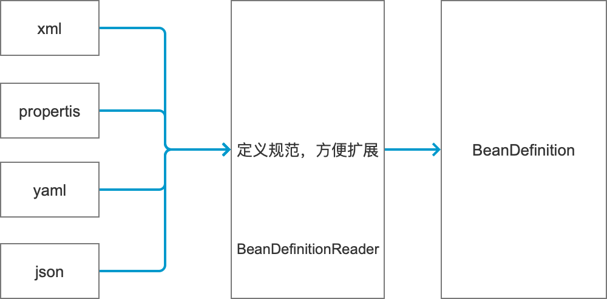
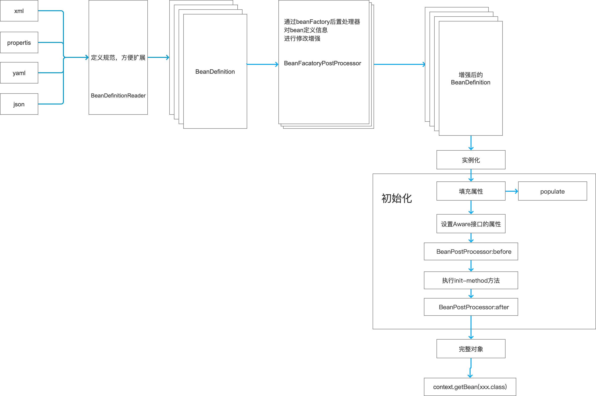
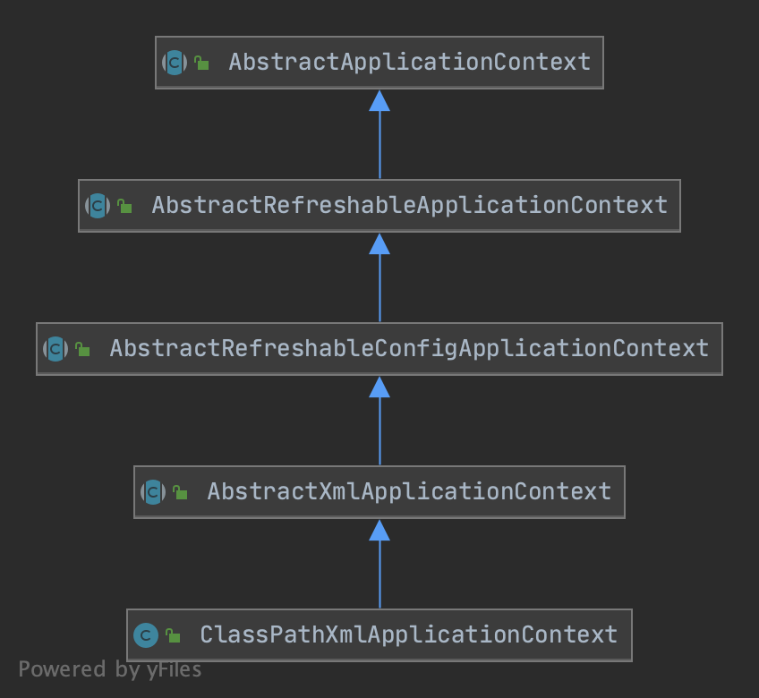
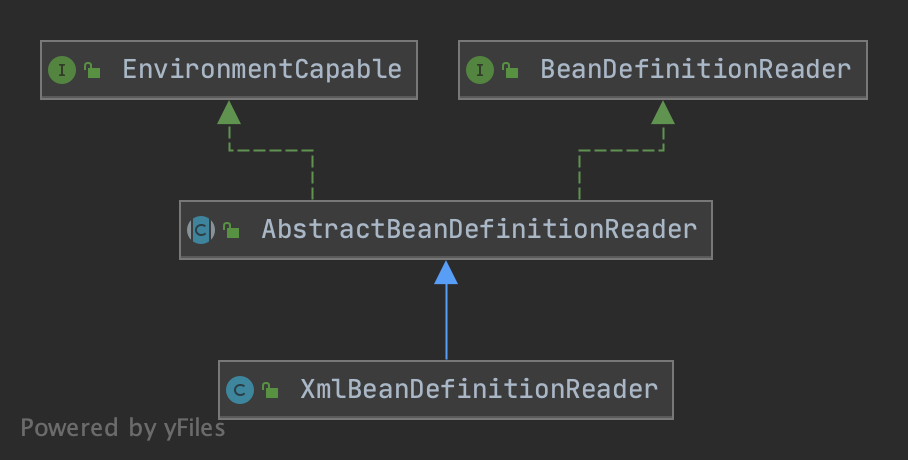

# Spring源码


## 1. 基本概述

Spring是java的开发框架，它引申出一系列生态框架：springBoot,springClould等等。无论是springBoot还是springcClould它的底层都是围绕Spring作为基石。

Spring源码提供了很多扩展点，了解其中的扩展点，我们就可以在日常Spring开发工作中为所欲为。

聊到Spring,大家第一次想到的可能是IOC、AOP。

### 1.1. IOC是什么呢？

IOC叫控制反转，原来我们创建对象都是new一个对象，在Spring中，创建对象的工作交给Spring容器来完成。那么，IOC在Spring中是如何实现的呢？这里又引出一个新名词 DI（依赖注入）。IOC和DI有什么区别呢，IOC它是一种编程思想，DI是可以叫一种实现手段。

Spring应用中可以有一个或多个IOC容器,IOC容器中存放创建好的bean对象。

### 1.2. 如何创建Bean对象？

一开始学习Spring，我们可能第一次接触到的是使用xml文件来定义bean。

```xml
<beans>
  <bean id=? class=?>
  	<property name=? value=? />
    <property name=? ref=? />
  </bean>
  
  <bean id=? class=?>
    <constructor-arg name=? value=? />
  </bean>
</beans>
```

有了配置文件，那我们需要去加载配置文件，然后经过一系列操作把Spring容器创建出来。

```java
// 加载bean定义配置文件，创建spring容器
ApplicationContext context = new ClassPathXmlApplicationContext("applicationContext.xml");
// 需要使用时，通过getBean方法获取对象
ClassBean bean = context.getBean("xxx");
```

刚刚这些代码Spring干了一些什么事呢？

1. 加载xml文件。
2. 解析xml文件。
3. 封装BeanDefinition。
4. 实例化。
5. 放到容器中。
6. 从容器中获取。

### 1.3 Spring对象创建过程

加载BeanDefinition。

  

Spring中提供了BeanDefinitionReader接口，提供给我们扩展加载BeanDefinition的方式。



BeanDefinition将被BeanFactory加载到容器中，并可以通过BeanFactoryPostProcessor对已经加载到内存的BeanDefinition进行增强处理得到最终的BeanDefinition。此时，容器可以通过反射的方式开始对Bean进行实例化。

在Bean实例化过程中，可能存在循环依赖的问题，spirng中使用了三级缓存的办法解决这一问题，后续篇幅会着重讲解。


后续章节将开始对一个Spring基础应用启动过程涉及到的源码点进行详细讲解。


## 2. 容器创建过程源码概要分析

我们通过一下代码启动一个Spring应用。

```java
ApplicationContext context = new ClassPathXmlApplicationContext("applicationContext.xml");
```

我们从它的构造函数开始入手

```java
public ClassPathXmlApplicationContext(
			String[] configLocations, boolean refresh, @Nullable ApplicationContext parent)
			throws BeansException {
		// 1. 设置父容器,调用父类构造器，对相关的属性进行初始化
		super(parent);
		// 2. 设置 xml配置路径，解析配置文件占位符
		setConfigLocations(configLocations);
		// 3. 创建容器主流程
		if (refresh) {
			refresh();
		}
	}
```


构造方法中，第一步调用父类的构造方法,我们看下`ClassPathXmlApplicationContext`的类图。




```java
public AbstractApplicationContext(@Nullable ApplicationContext parent) {
		// 调用无参构造函数
		this();
		//  设置父容器
		setParent(parent);
}

public AbstractApplicationContext() {
  	// 设置 资源解析类
		this.resourcePatternResolver = getResourcePatternResolver();
	}

// 该方法为protected供子类重写来解析不同的资源文件
protected ResourcePatternResolver getResourcePatternResolver() {
  	// 返回资源解析器来将路径解析成Resource实例 例如： classPath:xxx.xml
		return new PathMatchingResourcePatternResolver(this);
	}
```

第二步`setConfigLocations`解析配置文件路径，可对文件路径中的占位符进行替换。例如加载的配置为`classpath:${filename}-conf.xml`,这里将通过`Environment`实例尝试对`${filename}`进行替换处理。

```java
public void setConfigLocations(@Nullable String... locations) {
		if (locations != null) {
			Assert.noNullElements(locations, "Config locations must not be null");
			this.configLocations = new String[locations.length];
			for (int i = 0; i < locations.length; i++) {
				this.configLocations[i] = resolvePath(locations[i]).trim();
			}
		}
		else {
			this.configLocations = null;
		}
	}

protected String resolvePath(String path) {
		//使用环境实例对象对占位符进行处理
		return getEnvironment().resolveRequiredPlaceholders(path);
	}
```

第三步开始进入容器创建的主流程`refresh`。

主要经过一下步骤：

1. 容器刷新前准备。
2. 创建 beanFactory。
3. 对 beanFactory 进行初始化。
4. 执行beanFactory的后置处理方法。
5. 调用bean工厂后置处理器。
6. 注册bean处理器。
7. 国际化资源处理。
8. 初始化广播器。
9. 给子类实现来初始化特殊的bean实例。
10. 注册监听器。
11. 实例化剩余的非懒加载的单例对象。
12. 12.容器创建完毕，执行最后的清理工作。

```java
	@Override
	public void refresh() throws BeansException, IllegalStateException {
		synchronized (this.startupShutdownMonitor) {
			// Prepare this context for refreshing.
			// 1. 容器刷新前准备：如果没有创建环境实例则创建一个实例、设置应用前置监听器。
			prepareRefresh();

			// Tell the subclass to refresh the internal bean factory.
			// 2. 创建 beanFactory
			ConfigurableListableBeanFactory beanFactory = obtainFreshBeanFactory();

			// Prepare the bean factory for use in this context.
			// 3. 对 beanFactory 进行初始化（将容器的属性放入beanFactory）
			prepareBeanFactory(beanFactory);

			try {
				// Allows post-processing of the bean factory in context subclasses.
				// 4. beanFactory的后置处理方法，默认为空方法
				postProcessBeanFactory(beanFactory);

				// Invoke factory processors registered as beans in the context.

				// 5. 调用bean工厂后置处理器
				invokeBeanFactoryPostProcessors(beanFactory);

				// Register bean processors that intercept bean creation.
				// 6.注册bean处理器
				registerBeanPostProcessors(beanFactory);

				// Initialize message source for this context.
				// 7.国际化
				initMessageSource();

				// Initialize event multicaster for this context.
				// 8.初始化广播器
				initApplicationEventMulticaster();

				// Initialize other special beans in specific context subclasses.
				// 9.初始化其他的 bean 空方法
				onRefresh();

				// Check for listener beans and register them.
				// 10.注册监听器
				registerListeners();

				// Instantiate all remaining (non-lazy-init) singletons.
				// 11.实例化单例
				finishBeanFactoryInitialization(beanFactory);

				// Last step: publish corresponding event.
				// 12.容器创建完毕，执行最后的清理工作
				finishRefresh();
			}

			catch (BeansException ex) {
				if (logger.isWarnEnabled()) {
					logger.warn("Exception encountered during context initialization - " +
							"cancelling refresh attempt: " + ex);
				}

				// Destroy already created singletons to avoid dangling resources.
				destroyBeans();

				// Reset 'active' flag.
				cancelRefresh(ex);

				// Propagate exception to caller.
				throw ex;
			}

			finally {
				// Reset common introspection caches in Spring's core, since we
				// might not ever need metadata for singleton beans anymore...
				resetCommonCaches();
			}
		}
	}
```

下面章节将对`refrsh()`进行详细讲解。


## 3. `refresh()`分析


### 3.1.容器刷新前准备:`prepareRefresh()`

在应用刷新前：

- 设置容器启动和关闭标识。
- 初始化配置。
- 验证环境必要配置。
- 设置早期的应用监听器。
- 设置早期的事件，供事件广播器创建完毕后发布。

```java
protected void prepareRefresh() {
		// Switch to active.
		//设置启动时间
		this.startupDate = System.currentTimeMillis();
		// 设置 关闭标识
		this.closed.set(false);
		// 设置 激活标识
		this.active.set(true);
		if (logger.isDebugEnabled()) {
			if (logger.isTraceEnabled()) {
				logger.trace("Refreshing " + this);
			}
			else {
				logger.debug("Refreshing " + getDisplayName());
			}
		}

		// Initialize any placeholder property sources in the context environment.
		// 初始化其他的配置文件，默认实现未空方法
		initPropertySources();

		// Validate that all properties marked as required are resolvable:
		// see ConfigurablePropertyResolver#setRequiredProperties
		// 验证所有必须的配置是否都存在
		getEnvironment().validateRequiredProperties();

		// Store pre-refresh ApplicationListeners...
		// 设置应用监听
		if (this.earlyApplicationListeners == null) {
			this.earlyApplicationListeners = new LinkedHashSet<>(this.applicationListeners);
		}
		else {
			// Reset local application listeners to pre-refresh state.
			this.applicationListeners.clear();
			this.applicationListeners.addAll(this.earlyApplicationListeners);
		}

		// Allow for the collection of early ApplicationEvents,
		// to be published once the multicaster is available...
		// 存放早期的应用事件，在事件广播器创建完毕后将事件发布
		this.earlyApplicationEvents = new LinkedHashSet<>();
	}
```

### 3.2. 获取 bean工厂:`obtainFreshBeanFactory()`

获取bean工厂：

- 判断当前是否已经存在一个bean工厂，存在则先销毁。
- 创建`DefaultListableBeanFactory`：`createBeanFactory()`。
- 添加额外的属性值:`customizeBeanFactory(beanFactory)`。
- 加载`BeanDefinition`:`loadBeanDefinitions(beanFactory)`。

```java
// AbstractApplicationContext
protected ConfigurableListableBeanFactory obtainFreshBeanFactory() {
		refreshBeanFactory();
		return getBeanFactory();
	}

// AbstractRefreshableApplicationContext
@Override
protected final void refreshBeanFactory() throws BeansException {
  // 如果当前已经有beanFactory 先销毁关闭
  if (hasBeanFactory()) {
    destroyBeans();
    closeBeanFactory();
  }
  try {
    //创建一个beanFactory
    DefaultListableBeanFactory beanFactory = createBeanFactory();
    // 设置容器的ID
    beanFactory.setSerializationId(getId());
    //设置客户化属性
    customizeBeanFactory(beanFactory);
    //加载BeanDefinition
    loadBeanDefinitions(beanFactory);
    this.beanFactory = beanFactory;
  }
  catch (IOException ex) {
    throw new ApplicationContextException("I/O error parsing bean definition source for " + getDisplayName(), ex);
  }
}
```


#### 3.2.1. `createBeanFactory()`创建bean工厂

默认创建`DefaultListableBeanFactory`作为bean工厂实例，可供子类重写来创建自己的工厂实例。

在父类`AbstractAutowireCapableBeanFactory`构造中对一些`Aware`接口进行了忽略处理，这些在后续自动装配过程中能看到其使用的地方。

```java
protected DefaultListableBeanFactory createBeanFactory() {
		return new DefaultListableBeanFactory(getInternalParentBeanFactory());
	}
	
public AbstractAutowireCapableBeanFactory() {
		super();
		// 设置忽略自动装配的Aware接口，因为这些Aware接口将有对应的Aware处理类进行处理
		ignoreDependencyInterface(BeanNameAware.class);
		ignoreDependencyInterface(BeanFactoryAware.class);
		ignoreDependencyInterface(BeanClassLoaderAware.class);
	}
```


#### 3.2.2. `customizeBeanFactory(beanFactory)` 设置客户化属性

将容器中的客户化属性设置到bean工厂中：

- 是否允许bean定义重写。
- 是否允许循环引用。

可重写该方法，对bean工厂作更多的客户化设置。

```
protected void customizeBeanFactory(DefaultListableBeanFactory beanFactory) {
		//是否允许 bean定义重写
		if (this.allowBeanDefinitionOverriding != null) {
			beanFactory.setAllowBeanDefinitionOverriding(this.allowBeanDefinitionOverriding);
		}
		//是否允许循环引用
		if (this.allowCircularReferences != null) {
			beanFactory.setAllowCircularReferences(this.allowCircularReferences);
		}
	}
```

#### 3.2.3. `loadBeanDefinitions(beanFactory)` 加载Bean定义信息

加载Bean定义信息：

- 创建xml bean定义信息解析类。
- 设置相关的属性。
- 加载 bean定义信息。

```java
// AbstractXmlApplicationContext
@Override
protected void loadBeanDefinitions(DefaultListableBeanFactory beanFactory) throws BeansException, IOException {
  // Create a new XmlBeanDefinitionReader for the given BeanFactory.
  // 创建一个xml bean信息解析类
  XmlBeanDefinitionReader beanDefinitionReader = new XmlBeanDefinitionReader(beanFactory);

  // Configure the bean definition reader with this context's
  // resource loading environment.
  // 设置环境对象
  beanDefinitionReader.setEnvironment(this.getEnvironment());
  //设置 配置资源加载对象
  beanDefinitionReader.setResourceLoader(this);
  // 设置xml资源实体解析器
  beanDefinitionReader.setEntityResolver(new ResourceEntityResolver(this));

  // Allow a subclass to provide custom initialization of the reader,
  // then proceed with actually loading the bean definitions.
  // 钩子函数，允许子类对 beanDefinitionReader 进行额外的初始化
  initBeanDefinitionReader(beanDefinitionReader);

  //真正加载 bean definitions
  loadBeanDefinitions(beanDefinitionReader);
}
```

由于这里使用的是通过xml方式加载BeanDefinition的方式，于是这里使用的是XmlBeanDefinitionReader。下面是XmlBeanDefinitionReader类关系图。




- BeanDefinitionReader

  BeanDefinitionReader是spring中，用开解析bean定义信息的接口，定义了以下方法。

  ```java
  public interface BeanDefinitionReader {
  
  	/**
  	 * 返回 需要注册bean定义信息的beanFactory
  	 */
  	BeanDefinitionRegistry getRegistry();
  
  	/**
  	 * 返回 用于加载配置文件的 ResourceLoader对象来将BeanDefinition配置加载成Resource
  	 */
  	@Nullable
  	ResourceLoader getResourceLoader();
  
  	/**
  	 * 返回类加载器用于bean的加载
  	 * 建议不要过早地加载bean class而是只注册bean的定义信息
  	 */
  	@Nullable
  	ClassLoader getBeanClassLoader();
  
  	/**
  	 * 返回bean名称生成器，用于给bean生成名字
  	 */
  	BeanNameGenerator getBeanNameGenerator();
  
  	/**
  	 * 将单个Resource 加载成beanDefinition
  	 */
  	int loadBeanDefinitions(Resource resource) throws BeanDefinitionStoreException;
  
  	/**
  	 * 将Resource数组 加载成beanDefinition
  	 */
  	int loadBeanDefinitions(Resource... resources) throws BeanDefinitionStoreException;
  
  	/**
  	 * 从特殊的location加载 beanDefinition
  	 */
  	int loadBeanDefinitions(String location) throws BeanDefinitionStoreException;
  
  	/**
  	 * 从特殊的location加载 beanDefinition
  	 */
  	int loadBeanDefinitions(String... locations) throws BeanDefinitionStoreException;
  
  }
  
  ```

- AbstractBeanDefinitionReader

  是spring给我们提供的一个模板类，提供了大多数BeanDefinitionReader的实现方法，子类只须补充`int loadBeanDefinitions(Resource resource);`的实现即可实现自定义的BeanDefinitionReader。

  ```java
  public abstract class AbstractBeanDefinitionReader implements BeanDefinitionReader, EnvironmentCapable {
  
  	/** Logger available to subclasses. */
  	protected final Log logger = LogFactory.getLog(getClass());
  
  	/**
  	 * 需要注册bean定义信息的对象
  	 */
  	private final BeanDefinitionRegistry registry;
  
  	/**
  	 * 加载bean定义信息配置的对象
  	 */
  	@Nullable
  	private ResourceLoader resourceLoader;
  
  	/**
  	 * 用于加载bean Class的类加载器
  	 */
  	@Nullable
  	private ClassLoader beanClassLoader;
  	/**
  	 * 应用环境对象
  	 */
  	private Environment environment;
  	/**
  	 * bean名称生成器
  	 */
  	private BeanNameGenerator beanNameGenerator = DefaultBeanNameGenerator.INSTANCE;
  
  
  	/**
  	 * 创建一个BeanDefinitionReader通过给定的beanFactory
  	 * 如果beanFactory不光继承了BeanDefinitionRegistry还继承了ResourceLoader，那么它将被用作加载bean定义配置文件。
  	 * 否则将使用PathMatchingResourcePatternResolver来作为ResourceLoader
  	 *
  	 * 如果beanFactory实现了EnvironmentCapable，它的环境变量将存放在environment中
  	 * 否则使用StandardEnvironment
  	 */
  	protected AbstractBeanDefinitionReader(BeanDefinitionRegistry registry) {
  		Assert.notNull(registry, "BeanDefinitionRegistry must not be null");
  		this.registry = registry;
  
  		// Determine ResourceLoader to use.
  		if (this.registry instanceof ResourceLoader) {
  			this.resourceLoader = (ResourceLoader) this.registry;
  		}
  		else {
  			this.resourceLoader = new PathMatchingResourcePatternResolver();
  		}
  
  		// Inherit Environment if possible
  		if (this.registry instanceof EnvironmentCapable) {
  			this.environment = ((EnvironmentCapable) this.registry).getEnvironment();
  		}
  		else {
  			this.environment = new StandardEnvironment();
  		}
  	}
  
  
  	public final BeanDefinitionRegistry getBeanFactory() {
  		return this.registry;
  	}
  
  	@Override
  	public final BeanDefinitionRegistry getRegistry() {
  		return this.registry;
  	}
  
  	/**
  	 * 设置 bean定义信息资源加载器
  	 */
  	public void setResourceLoader(@Nullable ResourceLoader resourceLoader) {
  		this.resourceLoader = resourceLoader;
  	}
  
  	@Override
  	@Nullable
  	public ResourceLoader getResourceLoader() {
  		return this.resourceLoader;
  	}
  
  	/**
  	 * 设置bean Class类加载器
  	 */
  	public void setBeanClassLoader(@Nullable ClassLoader beanClassLoader) {
  		this.beanClassLoader = beanClassLoader;
  	}
  
  	@Override
  	@Nullable
  	public ClassLoader getBeanClassLoader() {
  		return this.beanClassLoader;
  	}
  
  	/**
  	 * 设置环境对象
  	 */
  	public void setEnvironment(Environment environment) {
  		Assert.notNull(environment, "Environment must not be null");
  		this.environment = environment;
  	}
  
  	@Override
  	public Environment getEnvironment() {
  		return this.environment;
  	}
  
  	/**
  	 * 设置Bean名称生成器
  	 */
  	public void setBeanNameGenerator(@Nullable BeanNameGenerator beanNameGenerator) {
  		this.beanNameGenerator = (beanNameGenerator != null ? beanNameGenerator : DefaultBeanNameGenerator.INSTANCE);
  	}
  
  	@Override
  	public BeanNameGenerator getBeanNameGenerator() {
  		return this.beanNameGenerator;
  	}
  
  	/**
  	 * 加载多个bean定义信息资源文件
  	 */
  	@Override
  	public int loadBeanDefinitions(Resource... resources) throws BeanDefinitionStoreException {
  		Assert.notNull(resources, "Resource array must not be null");
  		int count = 0;
  		for (Resource resource : resources) {
  			count += loadBeanDefinitions(resource);
  		}
  		return count;
  	}
  
  	/**
  	 * 加载指定路径的资源文件
  	 */
  	@Override
  	public int loadBeanDefinitions(String location) throws BeanDefinitionStoreException {
  		return loadBeanDefinitions(location, null);
  	}
  
  	/**
  	 * 加载特定路径下的资源文件
  	 */
  	public int loadBeanDefinitions(String location, @Nullable Set<Resource> actualResources) throws BeanDefinitionStoreException {
  		ResourceLoader resourceLoader = getResourceLoader();
  		if (resourceLoader == null) {
  			throw new BeanDefinitionStoreException(
  					"Cannot load bean definitions from location [" + location + "]: no ResourceLoader available");
  		}
  
  		if (resourceLoader instanceof ResourcePatternResolver) {
  			// Resource pattern matching available.
  			try {
  				Resource[] resources = ((ResourcePatternResolver) resourceLoader).getResources(location);
  				int count = loadBeanDefinitions(resources);
  				if (actualResources != null) {
  					Collections.addAll(actualResources, resources);
  				}
  				if (logger.isTraceEnabled()) {
  					logger.trace("Loaded " + count + " bean definitions from location pattern [" + location + "]");
  				}
  				return count;
  			}
  			catch (IOException ex) {
  				throw new BeanDefinitionStoreException(
  						"Could not resolve bean definition resource pattern [" + location + "]", ex);
  			}
  		}
  		else {
  			// Can only load single resources by absolute URL.
  			//通过绝对路径 加载单个资源
  			Resource resource = resourceLoader.getResource(location);
  			int count = loadBeanDefinitions(resource);
  			if (actualResources != null) {
  				actualResources.add(resource);
  			}
  			if (logger.isTraceEnabled()) {
  				logger.trace("Loaded " + count + " bean definitions from location [" + location + "]");
  			}
  			return count;
  		}
  	}
  
  	/**
  	 *  加载多个特定路径下的文件
  	 */
  	@Override
  	public int loadBeanDefinitions(String... locations) throws BeanDefinitionStoreException {
  		Assert.notNull(locations, "Location array must not be null");
  		int count = 0;
  		for (String location : locations) {
  			count += loadBeanDefinitions(location);
  		}
  		return count;
  	}
  
  }
  ```

- XmlBeanDefinitionReader

  下面我们通过分析XmlBeanDefinitionReader，看看spring配置文件中的各种`<bean></bean>...`标签是如何解析成bean定义信息的。