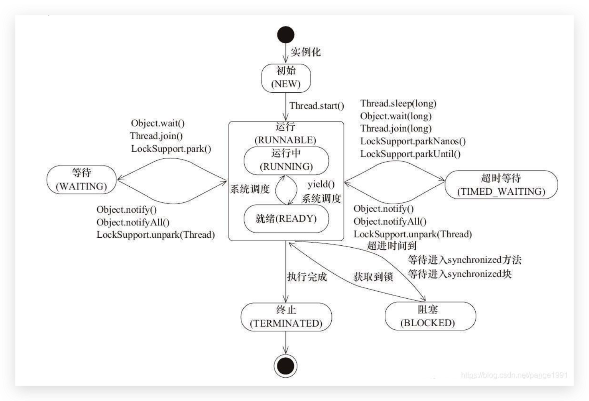

# 多线程

## 1. 创建线程的5种方法

- Runable
- 线程池 threadPool
- Callable
- FutureTask
- 继承Thread

## 2. 进程，线程，纤程

进程：资源分配的基本单位。

线程：任务调度的基本单位。

纤程：在用户模式下管理运行的的线程。

## 3. JAVA中线程的6中线程状态

- NEW 刚创建，还没启动

- RUNNABLE 可运行状态，由调度器安排执行

- WAITING 等待被唤醒

- TIMED WAITING 等待一段时间后自动唤醒

- BLOCKED 等待锁

- TERMINATED 终止

  

## 4. 线程打断 interrupt

- interrupt() 打断某个线程（设置标志位）
- isInterrupted() 查询某个线程是否被打断过(查询标志位)
- interrupted() 查询当前线程是否被打断过，并重置打断标志

