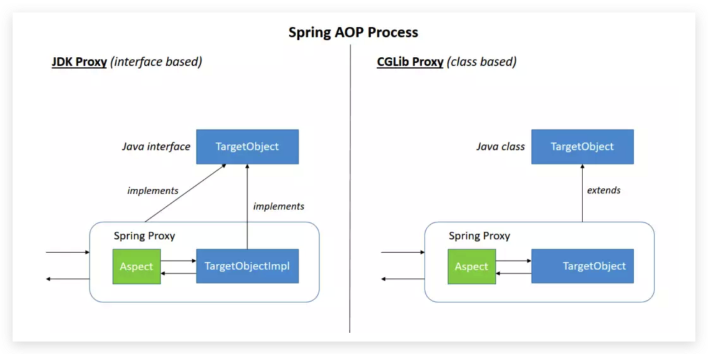

# Spring AOP

## 1. AOP介绍

AOP(Aspect-oriented Programming)面向切面编程，它是对于面向对象编程(OOP-Object-oriented Programming)的补充。

|      | 核心单元      | 顺序流程                     |
| ---- | ------------- | ---------------------------- |
| AOP  | 切面(Aspects) | 横向切面，基本与业务流程无关 |
| OOP  | 类(class)     | 纵向逻辑，跟业务流程相关     |

AOP的编程思想可以在不修改主要业务逻辑代码得同时，在此基础上添加一些与主要的业务逻辑无关的功能，通过横向抽取公共代码的方法，补充了传统纵向继承体系(OOP)无法解决的重复性代码优化(性能监视、事务管理、安全检查、缓存)，将业务逻辑和系统处理的代码(关闭连接、事务管理、操作日志记录)解耦。

先了解Spirng AOP框架中的重要的几个组件单元。

- 切面(Aspect):

- 连接点(Join Point):程序在运行期间的某个方法的执行。

- 通知(Advice):在切面中的某个连接点触发后发出的通知操作，有五种不同的通知类型：

  | 通知类型                  | 回调时机                         | 类                                           |
  | ------------------------- | -------------------------------- | -------------------------------------------- |
  | 环绕通知(Around)          | 在方法被调用前和调用后           | org.aopalliance.intercept.MethodInterceptor  |
  | 前置通知(Before Advice)   | 在方法被调用前                   | org.springframework.aop.MethodBeforeAdvice   |
  | 后置通知(After Advice)    | 在方法被调用后                   | org.springframework.aop.AfterAdvice          |
  | 返回通知(After-returning) | 在方法被成功执行后，返回结果之前 | org.springframework.aop.AfterReturningAdvice |
  | 异常通知(After-throwing)  | 在方法抛出异常后                 | org.springframework.aop.ThrowsAdvice         |

- 切入点(PointCut):表示一组连接点，与切入点表达式有关，通过切入点表达式匹配连接点，Spring默认使用AspectJ切入点表达式语言。

- 介绍(Introduction):可以为原有的对象增加新的属性和方法。

- 目标对象(Taget Object):由一个或多个切面代理的对象。

- 织入(Weaving):把增强应用到目标对象来创建代理对象的过程。

三种AOP织入时期

| 时期     | 描述                                                         |
| -------- | ------------------------------------------------------------ |
| 编译期   | 在目标类编译时织入，需要特殊的编译器支持。AspectJ的织入编译器采用这种方式。 |
| 类加载器 | 在目标类加载到JVM时织入，需要特殊的类加载器支持。            |
| 运行期   | 在应用运行时织入。Spring AOP采用这种方式，它为目标对象动态创建一个代理对象来实现。 |


## 2. Sprng AOP

通过以上的介绍，我们知道Spring AOP采用了AspectJ的切单表达式来筛选需要切面代理的对象，并在运行期间通过动态代理的方式将切面织入。

Spring AOP采用了JDK动态代理和CGLib动态代理的混合模式。



从上图中可以看到，JDK动态代理通过重写目标对象的接口来实现方法增强，这就需要目标对象必须实现接口，

而CGLib代理是通过继承目标对象的方式来实现。


Spring应用可通过注解或者xml配置的方式来实现AOP。

1. 首先要开启AspectJ支持。

   使用注解的方式,通过`@EnableAspectJAutoProxy`配置自动装配代理。

   ```java
   @Configuration
   @EnableAspectJAutoProxy
   public class AppConfig {}
   ```

   也可以使用xml配置。

   ```xml
   <?xml version="1.0" encoding="UTF-8"?>
   <beans xmlns="http://www.springframework.org/schema/beans"
       xmlns:xsi="http://www.w3.org/2001/XMLSchema-instance"
       xmlns:aop="http://www.springframework.org/schema/aop" xsi:schemaLocation="
           http://www.springframework.org/schema/beans https://www.springframework.org/schema/beans/spring-beans.xsd
           http://www.springframework.org/schema/aop https://www.springframework.org/schema/aop/spring-aop.xsd">
   	<aop:aspectj-autoproxy/>
   </beans>
   ```

2. 声明切面，并配置切点。

注解方式：

```java
@Aspect 
public class MyAspect {
  @Pointcut("execution(* transfer(..))") // 切入点表达式
	private void definePointcut() {}
}
```

xml方式：

```xml
<?xml version="1.0" encoding="UTF-8"?>
<beans xmlns="http://www.springframework.org/schema/beans"
       xmlns:xsi="http://www.w3.org/2001/XMLSchema-instance"
       xmlns:aop="http://www.springframework.org/schema/aop"
       xsi:schemaLocation="http://www.springframework.org/schema/beans
       https://www.springframework.org/schema/beans/spring-beans.xsd
       http://www.springframework.org/schema/aop
       https://www.springframework.org/schema/aop/spring-aop.xsd">
    <aop:aspectj-autoproxy/>

    <bean id="operateTest" class="com.test.learn.aop.OperateTest"/>

    <bean id="logAspect" class="com.test.learn.aop.LogAspect"/>

    <aop:config>
        <aop:aspect ref="logAspect">
            <aop:pointcut id="myPointCut" expression="execution(* com.test.learn.aop.*.*(..))"/>
            <aop:before method="before" pointcut-ref="myPointCut"/>
        </aop:aspect>

    </aop:config>
</beans>
```

## 3. Spring AOP源码分析

以下开始对spring AOP框架源码进行分析

### 3.1. 准备加载AOP相关的beanDefinition

在第2节得知可以通过注解或者xml文件来配置AOP，那么spring容器在创建的时候就会去加载对应的配置组装出AOP对象的beanDefinition以供后续创建核心的AOP对象。

下面以xml文件配置为例，分析beanDefinition对象组装过程。

解析自定义的beanDefinition需要自定义的命名空间解析器(NamespaceHandler),在spring-aop包中的`spring.handlers`文件声明了aop命名空间的解析器是`org.springframework.aop.config.AopNamespaceHandler`:

```properties
http\://www.springframework.org/schema/aop=org.springframework.aop.config.AopNamespaceHandler
```

```java
public class AopNamespaceHandler extends NamespaceHandlerSupport {

	/**
	 * Register the {@link BeanDefinitionParser BeanDefinitionParsers} for the
	 * '{@code config}', '{@code spring-configured}', '{@code aspectj-autoproxy}'
	 * and '{@code scoped-proxy}' tags.
	 */
	@Override
	public void init() {
		// In 2.0 XSD as well as in 2.5+ XSDs
		registerBeanDefinitionParser("config", new ConfigBeanDefinitionParser());
		registerBeanDefinitionParser("aspectj-autoproxy", new AspectJAutoProxyBeanDefinitionParser());
		registerBeanDefinitionDecorator("scoped-proxy", new ScopedProxyBeanDefinitionDecorator());

		// Only in 2.0 XSD: moved to context namespace in 2.5+
		registerBeanDefinitionParser("spring-configured", new SpringConfiguredBeanDefinitionParser());
	}

}
```

`AopNamespaceHandler`中注册了各个标签的解析器。

- config标签：`ConfigBeanDefinitionParser`

  ```xml
  <aop:config>
    <aop:aspect ref="logAspect">
      <aop:pointcut id="myPointCut" expression="execution(* com.test.learn.aop.*.*(..))"/>
      <aop:before method="before" pointcut-ref="myPointCut"/>
    </aop:aspect>
  </aop:config>
  ```

  以上面的xml文件为例，`config`中包含一个`aspect`标签，aspect标签中包含一个`pointcut`标签和一个`before`标签。

```java
public BeanDefinition parse(Element element, ParserContext parserContext) {
		CompositeComponentDefinition compositeDef =
				new CompositeComponentDefinition(element.getTagName(), parserContext.extractSource(element));
		parserContext.pushContainingComponent(compositeDef);
		// 注册自动代理创建器 AspectJAwareAdvisorAutoProxyCreator
		configureAutoProxyCreator(parserContext, element);
		// 解析aop:config子节点
		List<Element> childElts = DomUtils.getChildElements(element);
		for (Element elt: childElts) {
			String localName = parserContext.getDelegate().getLocalName(elt);
			// 解析 pointCut
			if (POINTCUT.equals(localName)) {
				parsePointcut(elt, parserContext);
			}
			// 解析 advisor
			else if (ADVISOR.equals(localName)) {
				parseAdvisor(elt, parserContext);
			}
			// 解析 aspect
			else if (ASPECT.equals(localName)) {
				parseAspect(elt, parserContext);
			}
		}

		parserContext.popAndRegisterContainingComponent();
		return null;
	}
```


### 3.2. 创建AOP相关的对象