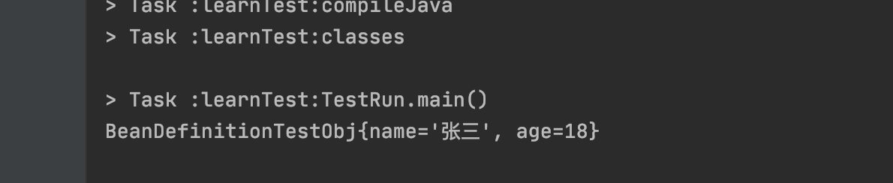

[TOC]

# 自定义BeanDefinitionReader

## 一、序言

本篇文章将讲述如何自定义BeanDefinitionReader，从Json配置文件中加载BeanDefiniton。

ClassPathXmlApplicationContext通过XmlBeanDefinitionReader来解析xml配置来注册BeanDefinition。

下图是ClassPathXmlApplicationContext加载注册BeanDefinition的主要流程图。


下面开始着手实现一个简单的JsonBeanDefinitionReader，通过以上的流程图，我们需要实现的部分就是BeanDefinitionReader部分。


## 二、定义Json配置格式

- name

  bean名称

- clazz

  class名称

- properties

  属性

```java
import org.springframework.beans.factory.config.BeanDefinition;
import org.springframework.beans.factory.support.BeanDefinitionBuilder;
import org.springframework.util.CollectionUtils;

import java.util.Map;

public class JsonBeanDefinition {
    /**
     * bean 名称
     */
    private String name;
    /**
     * class
     */
    private String clazz;
    /**
     * 属性
     */
    private Map<String,Properties> properties;

    public static class Properties{
        /**
         * 值
         */
        private String value;
        /**
         * 是否是bean引用
         */
        private boolean isRef=false;

        public String getValue() {
            return value;
        }

        public void setValue(String value) {
            this.value = value;
        }

        public boolean isRef() {
            return isRef;
        }

        public void setRef(boolean ref) {
            isRef = ref;
        }
    }

    public String getName() {
        return name;
    }

    public void setName(String name) {
        this.name = name;
    }


    public String getClazz() {
        return clazz;
    }

    public void setClazz(String clazz) {
        this.clazz = clazz;
    }

    public Map<String, Properties> getProperties() {
        return properties;
    }

    public void setProperties(Map<String, Properties> properties) {
        this.properties = properties;
    }

    /**
     * 将json配置转化成BeanDefinition
     * @return
     * @throws ClassNotFoundException
     */
    BeanDefinition toBeanDefinition() throws ClassNotFoundException {
        BeanDefinitionBuilder builder = BeanDefinitionBuilder.genericBeanDefinition(Class.forName(clazz));

        if(!CollectionUtils.isEmpty(properties)){
            for(Map.Entry<String,Properties> entry:properties.entrySet()){
                // 如果是引用
                if(entry.getValue().isRef()){
                    builder.addPropertyReference(entry.getKey(),entry.getValue().value);
                }else{
                    builder.addPropertyValue(entry.getKey(),entry.getValue().value);
                }
            }
        }
        return builder.getBeanDefinition();

    }
}
```


## 三、自定义BeanDefinitionReader

实现自己的`BeanDefinitionReader`，Spring已经为我们提供了模版类`AbstractBeanDefinitionReader`,使用该类我们需要实现的方法`int loadBeanDefinitions(Resource resource)`即可。

```java
import com.alibaba.fastjson.JSONObject;
import org.springframework.beans.factory.BeanDefinitionStoreException;
import org.springframework.beans.factory.config.BeanDefinition;
import org.springframework.beans.factory.support.AbstractBeanDefinitionReader;
import org.springframework.beans.factory.support.BeanDefinitionRegistry;
import org.springframework.core.io.Resource;
import org.springframework.util.CollectionUtils;

import java.io.*;
import java.util.List;
/**
* json bean定义信息加载器
*/
public class MyJsonBeanDefinitionReader extends AbstractBeanDefinitionReader {


    protected MyJsonBeanDefinitionReader(BeanDefinitionRegistry registry) {
        super(registry);
    }

    @Override
    public int loadBeanDefinitions(Resource resource) throws BeanDefinitionStoreException {
        // 自定义实现
        try {
            final InputStream inputStream = resource.getInputStream();
            // 注册BeanDefinition
            doRegisterBeanDefinition(inputStream);
        } catch (Exception e) {
            throw new BeanDefinitionStoreException(e.getMessage());
        }
        return 0;
    }

    private void doRegisterBeanDefinition(InputStream inputStream) throws IOException, ClassNotFoundException {
        // 从配置文件中加载配置信息
        BufferedReader bufferedReader = new BufferedReader(new InputStreamReader(inputStream));
        String str = null;
        StringBuilder sb = new StringBuilder();
        while(( str = bufferedReader.readLine())!=null){
            sb.append(str);
        }
        // 转化成配置信息
        List<JsonBeanDefinition> jsonBeanDefinitionList = JSONObject.parseArray(sb.toString(),JsonBeanDefinition.class);

        if(!CollectionUtils.isEmpty(jsonBeanDefinitionList)) {
            for (JsonBeanDefinition jsonBeanDefinition : jsonBeanDefinitionList) {
                // 将配置信息转化成BeanDefinition
                BeanDefinition definition = jsonBeanDefinition.toBeanDefinition();
                // 注册BeanDefinition
                this.getRegistry().registerBeanDefinition(jsonBeanDefinition.getName(), definition);
            }
        }
    }
}
```


## 四、使用自定义BeanDefinitionReader注册BeanDefinition

`AbstractApplicationContext`提供了一个容器创建模板方法`refresh()`。

主要经过一下步骤：

1. 容器刷新前准备。
2. 创建 beanFactory。
3. 对 beanFactory 进行初始化。
4. 执行beanFactory的后置处理方法。
5. 调用bean工厂后置处理器。
6. 注册bean处理器。
7. 国际化资源处理。
8. 初始化广播器。
9. 给子类实现来初始化特殊的bean实例。
10. 注册监听器。
11. 实例化剩余的非懒加载的单例对象。
12. 12.容器创建完毕，执行最后的清理工作。

```java
	@Override
	public void refresh() throws BeansException, IllegalStateException {
		synchronized (this.startupShutdownMonitor) {
			// Prepare this context for refreshing.
			// 1. 容器刷新前准备：如果没有创建环境实例则创建一个实例、设置应用前置监听器。
			prepareRefresh();

			// Tell the subclass to refresh the internal bean factory.
			// 2. 创建 beanFactory
			ConfigurableListableBeanFactory beanFactory = obtainFreshBeanFactory();

			// Prepare the bean factory for use in this context.
			// 3. 对 beanFactory 进行初始化（将容器的属性放入beanFactory）
			prepareBeanFactory(beanFactory);

			try {
				// Allows post-processing of the bean factory in context subclasses.
				// 4. beanFactory的后置处理方法，默认为空方法
				postProcessBeanFactory(beanFactory);

				// Invoke factory processors registered as beans in the context.

				// 5. 调用bean工厂后置处理器
				invokeBeanFactoryPostProcessors(beanFactory);

				// Register bean processors that intercept bean creation.
				// 6.注册bean处理器
				registerBeanPostProcessors(beanFactory);

				// Initialize message source for this context.
				// 7.国际化
				initMessageSource();

				// Initialize event multicaster for this context.
				// 8.初始化广播器
				initApplicationEventMulticaster();

				// Initialize other special beans in specific context subclasses.
				// 9.初始化其他的 bean 空方法
				onRefresh();

				// Check for listener beans and register them.
				// 10.注册监听器
				registerListeners();

				// Instantiate all remaining (non-lazy-init) singletons.
				// 11.实例化单例
				finishBeanFactoryInitialization(beanFactory);

				// Last step: publish corresponding event.
				// 12.容器创建完毕，执行最后的清理工作
				finishRefresh();
			}

			catch (BeansException ex) {
				if (logger.isWarnEnabled()) {
					logger.warn("Exception encountered during context initialization - " +
							"cancelling refresh attempt: " + ex);
				}

				// Destroy already created singletons to avoid dangling resources.
				destroyBeans();

				// Reset 'active' flag.
				cancelRefresh(ex);

				// Propagate exception to caller.
				throw ex;
			}

			finally {
				// Reset common introspection caches in Spring's core, since we
				// might not ever need metadata for singleton beans anymore...
				resetCommonCaches();
			}
		}
	}
```

加载BeanDefinition是在创建完BeanFactory之后，也就是第3步：`prepareBeanFactory(beanFactory)`中。

下面手动实现`AbstractApplicationContext`通过重写`prepareBeanFactory(beanFactory)`使用刚刚定义的`MyJsonDefinitionReader`来加载注册`BeanDefinition`。

```java
import org.springframework.beans.BeansException;
import org.springframework.beans.factory.config.ConfigurableListableBeanFactory;
import org.springframework.beans.factory.support.DefaultListableBeanFactory;
import org.springframework.context.support.AbstractApplicationContext;


public class ClassPathJsonApplicationContext extends AbstractApplicationContext {
    // 存放json配置路径
    private String[] location;

    private volatile DefaultListableBeanFactory beanFactory;

    public ClassPathJsonApplicationContext(String... location) {
        this.location = location;
        refresh();
    }

    @Override
    protected void refreshBeanFactory() throws BeansException, IllegalStateException {
            //创建一个beanFactory
            DefaultListableBeanFactory beanFactory = createBeanFactory();
            // 设置容器的ID
            beanFactory.setSerializationId(getId());
            //加载BeanDefinition
            loadBeanDefinitions(beanFactory);
            this.beanFactory = beanFactory;
    }

    private void loadBeanDefinitions(DefaultListableBeanFactory beanFactory) {
        MyJsonBeanDefinitionReader myJsonBeanDefinitionReader = new MyJsonBeanDefinitionReader(beanFactory);
        myJsonBeanDefinitionReader.loadBeanDefinitions(location);
    }

    private DefaultListableBeanFactory createBeanFactory() {
        DefaultListableBeanFactory defaultListableBeanFactory = new DefaultListableBeanFactory(getInternalParentBeanFactory());;
        return defaultListableBeanFactory;
    }

    @Override
    protected void closeBeanFactory() {
        DefaultListableBeanFactory beanFactory = this.beanFactory;
        if (beanFactory != null) {
            beanFactory.setSerializationId(null);
            this.beanFactory = null;
        }
    }

    @Override
    public ConfigurableListableBeanFactory getBeanFactory() throws IllegalStateException {
        return this.beanFactory;
    }
}
```

## 五、测试运行

1. 新建一个测试类来测试生成该类的bean

   ```java
   public class BeanDefinitionTestObj {
       private String name;
       private int age;
   
       public String getName() {
           return name;
       }
   
       public void setName(String name) {
           this.name = name;
       }
   
       public int getAge() {
           return age;
       }
   
       public void setAge(int age) {
           this.age = age;
       }
   
       @Override
       public String toString() {
           return "BeanDefinitionTestObj{" +
                   "name='" + name + '\'' +
                   ", age=" + age +
                   '}';
       }
   }
   ```

2. 新建一个json配置文件:beanDefinitionTest.json

   ```json
   [
     {
       "name":"testBean",
       "clazz": "com.test.learn.beanDefinitionReader.BeanDefinitionTestObj",
       "properties": {
         "name": {
           "value": "张三"
         },
         "age": {
           "value": "18"
         }
       }
     }
   ]
   ```

3. 测试运行

```java
public class TestRun {
    public static void main(String[] args) {
        ClassPathJsonApplicationContext applicationContext = new ClassPathJsonApplicationContext("classpath:beanDefinitionTest.json");
        System.out.println(applicationContext.getBean("testBean"));
    }
}
```

4. 结果

   

