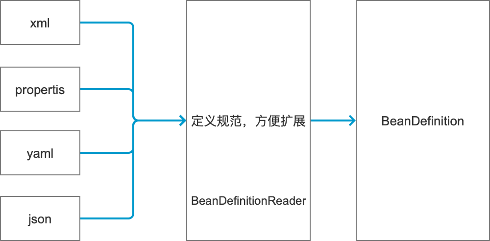

# Spring源码

[TOC]


## 1. 基本概述

Spring是java的开发框架，它引申出一系列生态框架：springBoot,springClould等等。无论是springBoot还是springcClould它的底层都是围绕Spring作为基石。

Spring源码提供了很多扩展点，了解其中的扩展点，我们就可以在日常Spring开发工作中为所欲为。

聊到Spring,大家第一次想到的可能是IOC、AOP。

### 1.1. IOC是什么呢？

IOC叫控制反转，原来我们创建对象都是new一个对象，在Spring中，创建对象的工作交给Spring容器来完成。那么，IOC在Spring中是如何实现的呢？这里又引出一个新名词 DI（依赖注入）。IOC和DI有什么区别呢，IOC它是一种编程思想，DI是可以叫一种实现手段。

这些概念在官网和论坛上已经有很多解释，这里不重复赘述。

Spring应用中可以有一个或多个IOC容器,IOC容器中存放创建好的bean对象。

### 1.2. 如何创建Bean对象？

一开始学习Spring，我们可能第一次接触到的是使用xml文件来定义bean。

```xml
<beans>
  <bean id=? class=?>
  	<property name=? value=? />
    <property name=? ref=? />
  </bean>
  
  <bean id=? class=?>
    <constructor-arg name=? value=? />
  </bean>
</beans>
```

有了配置文件，那我们需要去加载配置文件，然后经过一系列操作把Spring容器创建出来。

```java
// 加载bean定义配置文件，创建spring容器
ApplicationContext context = new ClassPathXmlApplicationContext("applicationContext.xml");
// 需要使用时，通过getBean方法获取对象
ClassBean bean = context.getBean("xxx");
```

刚刚这些代码Spring干了一些什么事呢？

1. 加载xml文件。
2. 解析xml文件。
3. 封装BeanDefinition。
4. 实例化。
5. 放到容器中。
6. 从容器中获取。

### 1.3 Spring对象创建过程

加载BeanDefinition。

  

Spring中提供了BeanDefinitionReader接口，提供给我们扩展加载BeanDefinition的方式。


BeanDefinition将被BeanFactory加载到容器中，并可以通过BeanFactoryPostProcessor对已经加载到内存的BeanDefinition进行增强处理得到最终的BeanDefinition。此时，容器可以通过反射的方式开始对Bean进行实例化。

在Bean实例化过程中，可能存在循环依赖的问题，spirng中使用了三级缓存的办法解决这一问题，后续篇幅会着重讲解。


后续章节将开始对一个Spring基础应用启动过程涉及到的源码点进行详细讲解。


## 2. 容器创建过程源码概要分析

我们通过一下代码启动一个Spring应用。

```java
ApplicationContext context = new ClassPathXmlApplicationContext("applicationContext.xml");
```

我们从它的构造函数开始入手

```java
public ClassPathXmlApplicationContext(
			String[] configLocations, boolean refresh, @Nullable ApplicationContext parent)
			throws BeansException {
		// 1. 设置父容器,调用父类构造器，对相关的属性进行初始化
		super(parent);
		// 2. 设置 xml配置路径，解析配置文件占位符
		setConfigLocations(configLocations);
		// 3. 创建容器主流程
		if (refresh) {
			refresh();
		}
	}
```


构造方法中，第一步调用父类的构造方法,我们看下`ClassPathXmlApplicationContext`的类图。


```java
public AbstractApplicationContext(@Nullable ApplicationContext parent) {
		// 调用无参构造函数
		this();
		//  设置父容器
		setParent(parent);
}

public AbstractApplicationContext() {
  	// 设置 资源解析类
		this.resourcePatternResolver = getResourcePatternResolver();
	}

// 该方法为protected供子类重写来解析不同的资源文件
protected ResourcePatternResolver getResourcePatternResolver() {
  	// 返回资源解析器来将路径解析成Resource实例 例如： classPath:xxx.xml
		return new PathMatchingResourcePatternResolver(this);
	}
```

第二步`setConfigLocations`解析配置文件路径，可对文件路径中的占位符进行替换。例如加载的配置为`classpath:${filename}-conf.xml`,这里将通过`Environment`实例尝试对`${filename}`进行替换处理。

```java
public void setConfigLocations(@Nullable String... locations) {
		if (locations != null) {
			Assert.noNullElements(locations, "Config locations must not be null");
			this.configLocations = new String[locations.length];
			for (int i = 0; i < locations.length; i++) {
				this.configLocations[i] = resolvePath(locations[i]).trim();
			}
		}
		else {
			this.configLocations = null;
		}
	}

protected String resolvePath(String path) {
		//使用环境实例对象对占位符进行处理
		return getEnvironment().resolveRequiredPlaceholders(path);
	}
```

第三步开始进入容器创建的主流程`refresh`。

主要经过一下步骤：

1. 容器刷新前准备。
2. 创建 beanFactory。
3. 对 beanFactory 进行初始化。
4. 执行beanFactory的后置处理方法。
5. 调用bean工厂后置处理器。
6. 注册bean处理器。
7. 国际化资源处理。
8. 初始化广播器。
9. 给子类实现来初始化特殊的bean实例。
10. 注册监听器。
11. 实例化剩余的非懒加载的单例对象。
12. 12.容器创建完毕，执行最后的清理工作。

```java
	@Override
	public void refresh() throws BeansException, IllegalStateException {
		synchronized (this.startupShutdownMonitor) {
			// Prepare this context for refreshing.
			// 1. 容器刷新前准备：如果没有创建环境实例则创建一个实例、设置应用前置监听器。
			prepareRefresh();

			// Tell the subclass to refresh the internal bean factory.
			// 2. 创建 beanFactory
			ConfigurableListableBeanFactory beanFactory = obtainFreshBeanFactory();

			// Prepare the bean factory for use in this context.
			// 3. 对 beanFactory 进行初始化（将容器的属性放入beanFactory）
			prepareBeanFactory(beanFactory);

			try {
				// Allows post-processing of the bean factory in context subclasses.
				// 4. beanFactory的后置处理方法，默认为空方法
				postProcessBeanFactory(beanFactory);

				// Invoke factory processors registered as beans in the context.

				// 5. 调用bean工厂后置处理器
				invokeBeanFactoryPostProcessors(beanFactory);

				// Register bean processors that intercept bean creation.
				// 6.注册bean处理器
				registerBeanPostProcessors(beanFactory);

				// Initialize message source for this context.
				// 7.国际化
				initMessageSource();

				// Initialize event multicaster for this context.
				// 8.初始化广播器
				initApplicationEventMulticaster();

				// Initialize other special beans in specific context subclasses.
				// 9.初始化其他的 bean 空方法
				onRefresh();

				// Check for listener beans and register them.
				// 10.注册监听器
				registerListeners();

				// Instantiate all remaining (non-lazy-init) singletons.
				// 11.实例化单例
				finishBeanFactoryInitialization(beanFactory);

				// Last step: publish corresponding event.
				// 12.容器创建完毕，执行最后的清理工作
				finishRefresh();
			}

			catch (BeansException ex) {
				if (logger.isWarnEnabled()) {
					logger.warn("Exception encountered during context initialization - " +
							"cancelling refresh attempt: " + ex);
				}

				// Destroy already created singletons to avoid dangling resources.
				destroyBeans();

				// Reset 'active' flag.
				cancelRefresh(ex);

				// Propagate exception to caller.
				throw ex;
			}

			finally {
				// Reset common introspection caches in Spring's core, since we
				// might not ever need metadata for singleton beans anymore...
				resetCommonCaches();
			}
		}
	}
```

下面章节将对`refrsh()`进行详细讲解。


## 3. `refresh()`分析


### 3.1.容器刷新前准备:`prepareRefresh()`

在应用刷新前：

- 设置容器启动和关闭标识。
- 初始化配置。
- 验证环境必要配置。
- 设置早期的应用监听器。
- 设置早期的事件，供事件广播器创建完毕后发布。

```java
protected void prepareRefresh() {
		// Switch to active.
		//设置启动时间
		this.startupDate = System.currentTimeMillis();
		// 设置 关闭标识
		this.closed.set(false);
		// 设置 激活标识
		this.active.set(true);
		if (logger.isDebugEnabled()) {
			if (logger.isTraceEnabled()) {
				logger.trace("Refreshing " + this);
			}
			else {
				logger.debug("Refreshing " + getDisplayName());
			}
		}

		// Initialize any placeholder property sources in the context environment.
		// 初始化其他的配置文件，默认实现未空方法
		initPropertySources();

		// Validate that all properties marked as required are resolvable:
		// see ConfigurablePropertyResolver#setRequiredProperties
		// 验证所有必须的配置是否都存在
		getEnvironment().validateRequiredProperties();

		// Store pre-refresh ApplicationListeners...
		// 设置应用监听
		if (this.earlyApplicationListeners == null) {
			this.earlyApplicationListeners = new LinkedHashSet<>(this.applicationListeners);
		}
		else {
			// Reset local application listeners to pre-refresh state.
			this.applicationListeners.clear();
			this.applicationListeners.addAll(this.earlyApplicationListeners);
		}

		// Allow for the collection of early ApplicationEvents,
		// to be published once the multicaster is available...
		// 存放早期的应用事件，在事件广播器创建完毕后将事件发布
		this.earlyApplicationEvents = new LinkedHashSet<>();
	}
```

### 3.2. 获取 bean工厂:`obtainFreshBeanFactory()`

获取bean工厂：

- 判断当前是否已经存在一个bean工厂，存在则先销毁。
- 创建`DefaultListableBeanFactory`：`createBeanFactory()`。
- 添加额外的属性值:`customizeBeanFactory(beanFactory)`。
- 加载`BeanDefinition`:`loadBeanDefinitions(beanFactory)`。

```java
// AbstractApplicationContext
protected ConfigurableListableBeanFactory obtainFreshBeanFactory() {
		refreshBeanFactory();
		return getBeanFactory();
	}

// AbstractRefreshableApplicationContext
@Override
protected final void refreshBeanFactory() throws BeansException {
  // 如果当前已经有beanFactory 先销毁关闭
  if (hasBeanFactory()) {
    destroyBeans();
    closeBeanFactory();
  }
  try {
    //创建一个beanFactory
    DefaultListableBeanFactory beanFactory = createBeanFactory();
    // 设置容器的ID
    beanFactory.setSerializationId(getId());
    //设置客户化属性
    customizeBeanFactory(beanFactory);
    //加载BeanDefinition
    loadBeanDefinitions(beanFactory);
    this.beanFactory = beanFactory;
  }
  catch (IOException ex) {
    throw new ApplicationContextException("I/O error parsing bean definition source for " + getDisplayName(), ex);
  }
}
```


#### 3.2.1. `createBeanFactory()`创建bean工厂

默认创建`DefaultListableBeanFactory`作为bean工厂实例，可供子类重写来创建自己的工厂实例。

在父类`AbstractAutowireCapableBeanFactory`构造中对一些`Aware`接口进行了忽略处理，这些在后续自动装配过程中能看到其使用的地方。

```java
protected DefaultListableBeanFactory createBeanFactory() {
		return new DefaultListableBeanFactory(getInternalParentBeanFactory());
	}
	
public AbstractAutowireCapableBeanFactory() {
		super();
		// 设置忽略自动装配的Aware接口，因为这些Aware接口将有对应的Aware处理类进行处理
		ignoreDependencyInterface(BeanNameAware.class);
		ignoreDependencyInterface(BeanFactoryAware.class);
		ignoreDependencyInterface(BeanClassLoaderAware.class);
	}
```


#### 3.2.2. `customizeBeanFactory(beanFactory)` 设置客户化属性

将容器中的客户化属性设置到bean工厂中：

- 是否允许bean定义重写。
- 是否允许循环引用。

可重写该方法，对bean工厂作更多的客户化设置。

```
protected void customizeBeanFactory(DefaultListableBeanFactory beanFactory) {
		//是否允许 bean定义重写
		if (this.allowBeanDefinitionOverriding != null) {
			beanFactory.setAllowBeanDefinitionOverriding(this.allowBeanDefinitionOverriding);
		}
		//是否允许循环引用
		if (this.allowCircularReferences != null) {
			beanFactory.setAllowCircularReferences(this.allowCircularReferences);
		}
	}
```

#### 3.2.3. `loadBeanDefinitions(beanFactory)` 加载Bean定义信息

加载Bean定义信息：

- 创建xml bean定义信息解析器。
- 解析 bean定义信息。

```java
// AbstractXmlApplicationContext
@Override
protected void loadBeanDefinitions(DefaultListableBeanFactory beanFactory) throws BeansException, IOException {
  // Create a new XmlBeanDefinitionReader for the given BeanFactory.
  // 创建一个xml bean信息解析类
  XmlBeanDefinitionReader beanDefinitionReader = new XmlBeanDefinitionReader(beanFactory);

  // Configure the bean definition reader with this context's
  // resource loading environment.
  // 设置环境对象
  beanDefinitionReader.setEnvironment(this.getEnvironment());
  //设置 配置资源加载对象
  beanDefinitionReader.setResourceLoader(this);
  // 设置xml资源实体解析器
  beanDefinitionReader.setEntityResolver(new ResourceEntityResolver(this));

  // Allow a subclass to provide custom initialization of the reader,
  // then proceed with actually loading the bean definitions.
  // 钩子函数，允许子类对 beanDefinitionReader 进行额外的初始化
  initBeanDefinitionReader(beanDefinitionReader);

  //真正加载 bean definitions
  loadBeanDefinitions(beanDefinitionReader);
}
```

由于这里使用的是通过xml方式加载BeanDefinition的方式，于是这里使用的是XmlBeanDefinitionReader。下面是XmlBeanDefinitionReader类关系图。


- BeanDefinitionReader

  BeanDefinitionReader是spring中，用开解析bean定义信息的接口，定义了以下方法。

  ```java
  public interface BeanDefinitionReader {
  
  	/**
  	 * 返回 需要注册bean定义信息的beanFactory
  	 */
  	BeanDefinitionRegistry getRegistry();
  
  	/**
  	 * 返回 用于加载配置文件的 ResourceLoader对象来将BeanDefinition配置加载成Resource
  	 */
  	@Nullable
  	ResourceLoader getResourceLoader();
  
  	/**
  	 * 返回类加载器用于bean的加载
  	 * 建议不要过早地加载bean class而是只注册bean的定义信息
  	 */
  	@Nullable
  	ClassLoader getBeanClassLoader();
  
  	/**
  	 * 返回bean名称生成器，用于给bean生成名字
  	 */
  	BeanNameGenerator getBeanNameGenerator();
  
  	/**
  	 * 将单个Resource 加载成beanDefinition
  	 */
  	int loadBeanDefinitions(Resource resource) throws BeanDefinitionStoreException;
  
  	/**
  	 * 将Resource数组 加载成beanDefinition
  	 */
  	int loadBeanDefinitions(Resource... resources) throws BeanDefinitionStoreException;
  
  	/**
  	 * 从特殊的location加载 beanDefinition
  	 */
  	int loadBeanDefinitions(String location) throws BeanDefinitionStoreException;
  
  	/**
  	 * 从特殊的location加载 beanDefinition
  	 */
  	int loadBeanDefinitions(String... locations) throws BeanDefinitionStoreException;
  
  }
  
  ```

- AbstractBeanDefinitionReader

  是spring给我们提供的一个模板类，提供了大多数BeanDefinitionReader的实现方法，子类只须补充`int loadBeanDefinitions(Resource resource);`的实现即可实现自定义的BeanDefinitionReader。

  ```java
  public abstract class AbstractBeanDefinitionReader implements BeanDefinitionReader, EnvironmentCapable {
  
  	/** Logger available to subclasses. */
  	protected final Log logger = LogFactory.getLog(getClass());
  
  	/**
  	 * 需要注册bean定义信息的对象
  	 */
  	private final BeanDefinitionRegistry registry;
  
  	/**
  	 * 加载bean定义信息配置的对象
  	 */
  	@Nullable
  	private ResourceLoader resourceLoader;
  
  	/**
  	 * 用于加载bean Class的类加载器
  	 */
  	@Nullable
  	private ClassLoader beanClassLoader;
  	/**
  	 * 应用环境对象
  	 */
  	private Environment environment;
  	/**
  	 * bean名称生成器
  	 */
  	private BeanNameGenerator beanNameGenerator = DefaultBeanNameGenerator.INSTANCE;
  
  
  	/**
  	 * 创建一个BeanDefinitionReader通过给定的beanFactory
  	 * 如果beanFactory不光继承了BeanDefinitionRegistry还继承了ResourceLoader，那么它将被用作加载bean定义配置文件。
  	 * 否则将使用PathMatchingResourcePatternResolver来作为ResourceLoader
  	 *
  	 * 如果beanFactory实现了EnvironmentCapable，它的环境变量将存放在environment中
  	 * 否则使用StandardEnvironment
  	 */
  	protected AbstractBeanDefinitionReader(BeanDefinitionRegistry registry) {
  		Assert.notNull(registry, "BeanDefinitionRegistry must not be null");
  		this.registry = registry;
  
  		// Determine ResourceLoader to use.
  		if (this.registry instanceof ResourceLoader) {
  			this.resourceLoader = (ResourceLoader) this.registry;
  		}
  		else {
  			this.resourceLoader = new PathMatchingResourcePatternResolver();
  		}
  
  		// Inherit Environment if possible
  		if (this.registry instanceof EnvironmentCapable) {
  			this.environment = ((EnvironmentCapable) this.registry).getEnvironment();
  		}
  		else {
  			this.environment = new StandardEnvironment();
  		}
  	}
  
  
  	public final BeanDefinitionRegistry getBeanFactory() {
  		return this.registry;
  	}
  
  	@Override
  	public final BeanDefinitionRegistry getRegistry() {
  		return this.registry;
  	}
  
  	/**
  	 * 设置 bean定义信息资源加载器
  	 */
  	public void setResourceLoader(@Nullable ResourceLoader resourceLoader) {
  		this.resourceLoader = resourceLoader;
  	}
  
  	@Override
  	@Nullable
  	public ResourceLoader getResourceLoader() {
  		return this.resourceLoader;
  	}
  
  	/**
  	 * 设置bean Class类加载器
  	 */
  	public void setBeanClassLoader(@Nullable ClassLoader beanClassLoader) {
  		this.beanClassLoader = beanClassLoader;
  	}
  
  	@Override
  	@Nullable
  	public ClassLoader getBeanClassLoader() {
  		return this.beanClassLoader;
  	}
  
  	/**
  	 * 设置环境对象
  	 */
  	public void setEnvironment(Environment environment) {
  		Assert.notNull(environment, "Environment must not be null");
  		this.environment = environment;
  	}
  
  	@Override
  	public Environment getEnvironment() {
  		return this.environment;
  	}
  
  	/**
  	 * 设置Bean名称生成器
  	 */
  	public void setBeanNameGenerator(@Nullable BeanNameGenerator beanNameGenerator) {
  		this.beanNameGenerator = (beanNameGenerator != null ? beanNameGenerator : DefaultBeanNameGenerator.INSTANCE);
  	}
  
  	@Override
  	public BeanNameGenerator getBeanNameGenerator() {
  		return this.beanNameGenerator;
  	}
  
  	/**
  	 * 加载多个bean定义信息资源文件
  	 */
  	@Override
  	public int loadBeanDefinitions(Resource... resources) throws BeanDefinitionStoreException {
  		Assert.notNull(resources, "Resource array must not be null");
  		int count = 0;
  		for (Resource resource : resources) {
  			count += loadBeanDefinitions(resource);
  		}
  		return count;
  	}
  
  	/**
  	 * 加载指定路径的资源文件
  	 */
  	@Override
  	public int loadBeanDefinitions(String location) throws BeanDefinitionStoreException {
  		return loadBeanDefinitions(location, null);
  	}
  
  	/**
  	 * 加载特定路径下的资源文件
  	 */
  	public int loadBeanDefinitions(String location, @Nullable Set<Resource> actualResources) throws BeanDefinitionStoreException {
  		ResourceLoader resourceLoader = getResourceLoader();
  		if (resourceLoader == null) {
  			throw new BeanDefinitionStoreException(
  					"Cannot load bean definitions from location [" + location + "]: no ResourceLoader available");
  		}
  
  		if (resourceLoader instanceof ResourcePatternResolver) {
  			// Resource pattern matching available.
  			try {
  				Resource[] resources = ((ResourcePatternResolver) resourceLoader).getResources(location);
  				int count = loadBeanDefinitions(resources);
  				if (actualResources != null) {
  					Collections.addAll(actualResources, resources);
  				}
  				if (logger.isTraceEnabled()) {
  					logger.trace("Loaded " + count + " bean definitions from location pattern [" + location + "]");
  				}
  				return count;
  			}
  			catch (IOException ex) {
  				throw new BeanDefinitionStoreException(
  						"Could not resolve bean definition resource pattern [" + location + "]", ex);
  			}
  		}
  		else {
  			// Can only load single resources by absolute URL.
  			//通过绝对路径 加载单个资源
  			Resource resource = resourceLoader.getResource(location);
  			int count = loadBeanDefinitions(resource);
  			if (actualResources != null) {
  				actualResources.add(resource);
  			}
  			if (logger.isTraceEnabled()) {
  				logger.trace("Loaded " + count + " bean definitions from location [" + location + "]");
  			}
  			return count;
  		}
  	}
  
  	/**
  	 *  加载多个特定路径下的文件
  	 */
  	@Override
  	public int loadBeanDefinitions(String... locations) throws BeanDefinitionStoreException {
  		Assert.notNull(locations, "Location array must not be null");
  		int count = 0;
  		for (String location : locations) {
  			count += loadBeanDefinitions(location);
  		}
  		return count;
  	}
  
  }
  ```

- XmlBeanDefinitionReader

  下面我们通过分析XmlBeanDefinitionReader，看看spring配置文件中的各种`<bean></bean>...`标签是如何解析成bean定义信息的。

  通过分析它的父类，我们得知要想实现一个bean定义解析器，继承了`AbstractBeanDefinitionReader`后，只需实现`int loadBeanDefinitions(Resource resource);`下面是XmlBeanDefinitionReader的实现。

  ```java
  @Override
  public int loadBeanDefinitions(Resource resource) throws BeanDefinitionStoreException {
    return loadBeanDefinitions(new EncodedResource(resource));
  }
  
  public int loadBeanDefinitions(EncodedResource encodedResource) throws BeanDefinitionStoreException {
    // 空判断
    Assert.notNull(encodedResource, "EncodedResource must not be null");
    if (logger.isTraceEnabled()) {
      logger.trace("Loading XML bean definitions from " + encodedResource);
    }
    // 获取正在加载中的Resource信息，避免循环加载xml。因为xml中可以import其他的xml，导致死循环
    Set<EncodedResource> currentResources = this.resourcesCurrentlyBeingLoaded.get();
    // 循环加载检查
    if (!currentResources.add(encodedResource)) {
      throw new BeanDefinitionStoreException(
        "Detected cyclic loading of " + encodedResource + " - check your import definitions!");
    }
    // 将Resource InputStream转化成InputSource
    try (InputStream inputStream = encodedResource.getResource().getInputStream()) {
      InputSource inputSource = new InputSource(inputStream);
      if (encodedResource.getEncoding() != null) {
        inputSource.setEncoding(encodedResource.getEncoding());
      }
      // 加载 InputSource
      return doLoadBeanDefinitions(inputSource, encodedResource.getResource());
    }
    catch (IOException ex) {
      throw new BeanDefinitionStoreException(
        "IOException parsing XML document from " + encodedResource.getResource(), ex);
    }
    finally {
      currentResources.remove(encodedResource);
      if (currentResources.isEmpty()) {
        this.resourcesCurrentlyBeingLoaded.remove();
      }
    }
  }
  
  protected int doLoadBeanDefinitions(InputSource inputSource, Resource resource) {
    try {
      // 将 inputSource转化成 document对象
      Document doc = doLoadDocument(inputSource, resource);
      // 解析 Document，注册bean定义信息
      int count = registerBeanDefinitions(doc, resource);
      if (logger.isDebugEnabled()) {
        logger.debug("Loaded " + count + " bean definitions from " + resource);
      }
      return count;
    }
    catch (BeanDefinitionStoreException ex) {
      throw ex;
    }
  }
  ```

  在解析Resource过程中，将`Resource`包装成`EncodedResource`提供使用特殊的编码来解析`Resource`的扩展点。然后将`EncodedResource`转化成`Document`对象，然后解析`Document`。

  ```java
  public int registerBeanDefinitions(Document doc, Resource resource) throws BeanDefinitionStoreException {
    // 获取 Document对象解析器
    BeanDefinitionDocumentReader documentReader = createBeanDefinitionDocumentReader();
    // 获取注册前 beanDefinition数量
    int countBefore = getRegistry().getBeanDefinitionCount();
    // 注册 beanDefinition
    documentReader.registerBeanDefinitions(doc, createReaderContext(resource));
    return getRegistry().getBeanDefinitionCount() - countBefore;
  }
  ```

  解析`Document`过程分为三步：

  1. 创建`Document`解析器。
  
     ```java
     /**
      * 默认的 Document解析类
      */
     private Class<? extends BeanDefinitionDocumentReader> documentReaderClass =
       DefaultBeanDefinitionDocumentReader.class;
     /**
      * 创建 Document解析器
      */
     protected BeanDefinitionDocumentReader createBeanDefinitionDocumentReader() {
       // 通过反射创建对象
       return BeanUtils.instantiateClass(this.documentReaderClass);
     }
     ```
  
  2. 获取命名空间解析器。
  
     在创建解析器上下文时会初始化默认的命名空间解析器`DefaultNamespaceHandlerResolver`。
  
     ```java
     /**
      * 创建解析上下文
      */
     public XmlReaderContext createReaderContext(Resource resource) {
       return new XmlReaderContext(resource, this.problemReporter, this.eventListener,
                                   this.sourceExtractor, this, getNamespaceHandlerResolver());
     }
     
     /**
      * 获取默认的命名空间解析器
      */
     public NamespaceHandlerResolver getNamespaceHandlerResolver() {
       if (this.namespaceHandlerResolver == null) {
         // 如果当前不存在则创建
         this.namespaceHandlerResolver = createDefaultNamespaceHandlerResolver();
       }
       return this.namespaceHandlerResolver;
     }
     
     /**
      * 创建命名空间解析器
      */
     protected NamespaceHandlerResolver createDefaultNamespaceHandlerResolver() {
       ClassLoader cl = (getResourceLoader() != null ? getResourceLoader().getClassLoader() : getBeanClassLoader());
       return new DefaultNamespaceHandlerResolver(cl);
     }
     ```
  
     下面看一下`DefaultNamespaceHandlerResolver`，`META-INF/spring.handlers`解析器配置文件路径，配置着各种命名空间的解析器。
  
     
  
     ```java
     public class DefaultNamespaceHandlerResolver implements NamespaceHandlerResolver {
     
     	/**
     	 * 命名空间解析器 默认的搜索路径
     	 */
     	public static final String DEFAULT_HANDLER_MAPPINGS_LOCATION = "META-INF/spring.handlers";
     
     	protected final Log logger = LogFactory.getLog(getClass());
     
     	@Nullable
     	private final ClassLoader classLoader;
     
     	/** Resource location to search for. */
     	private final String handlerMappingsLocation;
     
     	/**
     	 * 存储命名空间解析器
     	 */
     	@Nullable
     	private volatile Map<String, Object> handlerMappings;
     
     	public DefaultNamespaceHandlerResolver() {
     		this(null, DEFAULT_HANDLER_MAPPINGS_LOCATION);
     	}
     
     	/**
     	 * Create a new {@code DefaultNamespaceHandlerResolver} using the
     	 * default mapping file location.
     	 * @param classLoader the {@link ClassLoader} instance used to load mapping resources
     	 * (may be {@code null}, in which case the thread context ClassLoader will be used)
     	 * @see #DEFAULT_HANDLER_MAPPINGS_LOCATION
     	 */
     	public DefaultNamespaceHandlerResolver(@Nullable ClassLoader classLoader) {
     		this(classLoader, DEFAULT_HANDLER_MAPPINGS_LOCATION);
     	}
     
     	/**
     	 * Create a new {@code DefaultNamespaceHandlerResolver} using the
     	 * supplied mapping file location.
     	 * @param classLoader the {@link ClassLoader} instance used to load mapping resources
     	 * may be {@code null}, in which case the thread context ClassLoader will be used)
     	 * @param handlerMappingsLocation the mapping file location
     	 */
     	public DefaultNamespaceHandlerResolver(@Nullable ClassLoader classLoader, String handlerMappingsLocation) {
     		Assert.notNull(handlerMappingsLocation, "Handler mappings location must not be null");
     		this.classLoader = (classLoader != null ? classLoader : ClassUtils.getDefaultClassLoader());
     		this.handlerMappingsLocation = handlerMappingsLocation;
     	}
     
     
     	/**
     	 * Locate the {@link NamespaceHandler} for the supplied namespace URI
     	 * from the configured mappings.
     	 * @param namespaceUri the relevant namespace URI
     	 * @return the located {@link NamespaceHandler}, or {@code null} if none found
     	 */
     	@Override
     	@Nullable
     	public NamespaceHandler resolve(String namespaceUri) {
     		// 获取 命名空间处理器 map
     		Map<String, Object> handlerMappings = getHandlerMappings();
     		// 获取处理器className
     		Object handlerOrClassName = handlerMappings.get(namespaceUri);
     		if (handlerOrClassName == null) {
     			return null;
     		}
     		else if (handlerOrClassName instanceof NamespaceHandler) {
     			// 如果已经是一个实例则返回
     			return (NamespaceHandler) handlerOrClassName;
     		}
     		else {
     			// 否则通过反射生成生成对应的对象
     			String className = (String) handlerOrClassName;
     			try {
     				Class<?> handlerClass = ClassUtils.forName(className, this.classLoader);
     				if (!NamespaceHandler.class.isAssignableFrom(handlerClass)) {
     					throw new FatalBeanException("Class [" + className + "] for namespace [" + namespaceUri +
     							"] does not implement the [" + NamespaceHandler.class.getName() + "] interface");
     				}
     				NamespaceHandler namespaceHandler=(NamespaceHandler)BeanUtils.instantiateClass(handlerClass);
     				namespaceHandler.init();
     				handlerMappings.put(namespaceUri, namespaceHandler);
     				return namespaceHandler;
     			}
     			catch (ClassNotFoundException ex) {
     				throw new FatalBeanException("Could not find NamespaceHandler class [" + className +
     						"] for namespace [" + namespaceUri + "]", ex);
     			}
     			catch (LinkageError err) {
     				throw new FatalBeanException("Unresolvable class definition for NamespaceHandler class [" +
     						className + "] for namespace [" + namespaceUri + "]", err);
     			}
     		}
     	}
     
     	/**
     	 * Load the specified NamespaceHandler mappings lazily.
     	 */
     	private Map<String, Object> getHandlerMappings() {
     		Map<String, Object> handlerMappings = this.handlerMappings;
     		if (handlerMappings == null) {
     			synchronized (this) {
     				handlerMappings = this.handlerMappings;
     				if (handlerMappings == null) {
     					if (logger.isTraceEnabled()) {
     						logger.trace("Loading NamespaceHandler mappings from [" + this.handlerMappingsLocation + "]");
     					}
     					try {
     						// 加载 路径下的配置
     						Properties mappings =
     								PropertiesLoaderUtils.loadAllProperties(this.handlerMappingsLocation, this.classLoader);
     						if (logger.isTraceEnabled()) {
     							logger.trace("Loaded NamespaceHandler mappings: " + mappings);
     						}
     						handlerMappings = new ConcurrentHashMap<>(mappings.size());
     						CollectionUtils.mergePropertiesIntoMap(mappings, handlerMappings);
     						this.handlerMappings = handlerMappings;
     					}
     					catch (IOException ex) {
     						throw new IllegalStateException(
     								"Unable to load NamespaceHandler mappings from location [" + this.handlerMappingsLocation + "]", ex);
     					}
     				}
     			}
     		}
     		return handlerMappings;
     	}
     
     
     	@Override
     	public String toString() {
     		return "NamespaceHandlerResolver using mappings " + getHandlerMappings();
     	}
     
     }
     ```
  
     
  
  3. 使用解析器解析`Document`。
  
     开始进入正题，解析xml。在解析前检查profile是否是激活列表内，然后开始解析xml。
  
     如果是客户化命名空间，则进行客户化处理，否则使用默认命名空间处理器处理。
  
     这里只有`http://www.springframework.org/schema/beans`中定义的节点信息才算默认命名。
  
     ```java
     // DefaultBeanDefinitionDocumentReader
     /**
     	 * Register each bean definition within the given root {@code <beans/>} element.
     	 * 从给定的路径下注册所有的bean定义信息
     	 */
     	@SuppressWarnings("deprecation")  // for Environment.acceptsProfiles(String...)
     	protected void doRegisterBeanDefinitions(Element root) {
     		// Any nested <beans> elements will cause recursion in this method. In
     		// order to propagate and preserve <beans> default-* attributes correctly,
     		// keep track of the current (parent) delegate, which may be null. Create
     		// the new (child) delegate with a reference to the parent for fallback purposes,
     		// then ultimately reset this.delegate back to its original (parent) reference.
     		// this behavior emulates a stack of delegates without actually necessitating one.
     		// 暂存当前的bean解析类
     		BeanDefinitionParserDelegate parent = this.delegate;
     		this.delegate = createDelegate(getReaderContext(), root, parent);
     
     		// 如果当前的路径属于默认的命名空间，判断 profile是否在激活的列表内
     		if (this.delegate.isDefaultNamespace(root)) {
     			// 获取 profile
     			String profileSpec = root.getAttribute(PROFILE_ATTRIBUTE);
     			if (StringUtils.hasText(profileSpec)) {
     
     				String[] specifiedProfiles = StringUtils.tokenizeToStringArray(
     						profileSpec, BeanDefinitionParserDelegate.MULTI_VALUE_ATTRIBUTE_DELIMITERS);
     				// We cannot use Profiles.of(...) since profile expressions are not supported
     				// in XML config. See SPR-12458 for details.
     				if (!getReaderContext().getEnvironment().acceptsProfiles(specifiedProfiles)) {
     					if (logger.isDebugEnabled()) {
     						logger.debug("Skipped XML bean definition file due to specified profiles [" + profileSpec +
     								"] not matching: " + getReaderContext().getResource());
     					}
     					return;
     				}
     			}
     		}
     		// 对节点进行预处理，默认为空方法
     		preProcessXml(root);
     		// 解析bean定义信息
     		parseBeanDefinitions(root, this.delegate);
     		// 解析后处理，默认为空方法
     		postProcessXml(root);
     
     		this.delegate = parent;
     	}
     
     protected void parseBeanDefinitions(Element root, BeanDefinitionParserDelegate delegate) {
     		if (delegate.isDefaultNamespace(root)) {
     			NodeList nl = root.getChildNodes();
     			for (int i = 0; i < nl.getLength(); i++) {
     				Node node = nl.item(i);
     				if (node instanceof Element) {
     					Element ele = (Element) node;
     					if (delegate.isDefaultNamespace(ele)) {
     						parseDefaultElement(ele, delegate);
     					}
     					else {
                 // 客户化节点 xml解析器
     						delegate.parseCustomElement(ele);
     					}
     				}
     			}
     		}
     		else {
     			// 客户化命名空间 xml解析器
     			delegate.parseCustomElement(root);
     		}
     	}
     ```
  
     大概流程如下图
  
     

####  3.2.4. DefaultBeanDefinitionDocumentReader 解析xml过程细节分析

由于Spring在解析xml文档还存在很多细节的地方可以探索，于是这里新起一小节来继续深入分析。

上一节中，已经分析到开始递归解析xml节点信息。

```java
// DefaultBeanDefinitionDocumentReader
protected void parseBeanDefinitions(Element root, BeanDefinitionParserDelegate delegate) {
    // 检查是否是默认的命名空间
		if (delegate.isDefaultNamespace(root)) {
			NodeList nl = root.getChildNodes();
			for (int i = 0; i < nl.getLength(); i++) {
				Node node = nl.item(i);
				if (node instanceof Element) {
					Element ele = (Element) node;
					if (delegate.isDefaultNamespace(ele)) {
            // 递归解析 element
						parseDefaultElement(ele, delegate);
					}
					else {
            // 客户化节点 xml解析器
						delegate.parseCustomElement(ele);
					}
				}
			}
		}
		else {
			// 客户化命名空间 xml解析器
			delegate.parseCustomElement(root);
		}
	}
```

在解析过程中，实际干活的实际上已经委托给了`BeanDefinitionParserDelegate`。

`delegate.isDefaultNamespace(root)`判断是否属于spring默认的namespace。源码如下。

```java
public class BeanDefinitionParserDelegate {
	/**
	 * spring 默认的namespce uri
 	 */
	public static final String BEANS_NAMESPACE_URI = "http://www.springframework.org/schema/beans";
  
  /*...省略一大波代码...*/
  
  /**
	 * 检查是否属于 spring默认的命名空间
	 */
	public boolean isDefaultNamespace(Node node) {
		return isDefaultNamespace(getNamespaceURI(node));
	}

	private boolean isDefaultValue(String value) {
		return !StringUtils.hasLength(value) || DEFAULT_VALUE.equals(value);
	}
}
```

随后我们看到两个方法

##### 3.2.4.1. `parseDefaultElement(ele, delegate)`

   在这个方法中会解析标签中`import` `alias` `bean` `beans`元素。

   ```java
   private void parseDefaultElement(Element ele, BeanDefinitionParserDelegate delegate) {
     // 解析 import标签
     if (delegate.nodeNameEquals(ele, IMPORT_ELEMENT)) {
       importBeanDefinitionResource(ele);
     }
     // 解析 alias标签
     else if (delegate.nodeNameEquals(ele, ALIAS_ELEMENT)) {
       processAliasRegistration(ele);
     }
     // 解析 bean标签
     else if (delegate.nodeNameEquals(ele, BEAN_ELEMENT)) {
       processBeanDefinition(ele, delegate);
     }
     // 解析 beans标签
     else if (delegate.nodeNameEquals(ele, NESTED_BEANS_ELEMENT)) {
       // recurse
       doRegisterBeanDefinitions(ele);
     }
   }
   ```

###### 3.2.4.1.1. 解析`import`

递归调用解析器对导入的文件进行解析。

```java
protected void importBeanDefinitionResource(Element ele) {
  // 获取 resource 属性
  String location = ele.getAttribute(RESOURCE_ATTRIBUTE);
  if (!StringUtils.hasText(location)) {
    getReaderContext().error("Resource location must not be empty", ele);
    return;
  }

  // Resolve system properties: e.g. "${user.dir}"
  // 解析 路径中的占位符
  location = getReaderContext().getEnvironment().resolveRequiredPlaceholders(location);

  Set<Resource> actualResources = new LinkedHashSet<>(4);

  // Discover whether the location is an absolute or relative URI
  // 判断是绝对路径还是相对路径
  boolean absoluteLocation = false;
  try {
    absoluteLocation = ResourcePatternUtils.isUrl(location) || ResourceUtils.toURI(location).isAbsolute();
  }
  catch (URISyntaxException ex) {
    // cannot convert to an URI, considering the location relative
    // unless it is the well-known Spring prefix "classpath*:"
  }

  // Absolute or relative?
  if (absoluteLocation) {
    try {
      // 递归加载 beanDefinition
      int importCount = getReaderContext().getReader().loadBeanDefinitions(location, actualResources);
      if (logger.isTraceEnabled()) {
        logger.trace("Imported " + importCount + " bean definitions from URL location [" + location + "]");
      }
    }
    catch (BeanDefinitionStoreException ex) {
      getReaderContext().error(
        "Failed to import bean definitions from URL location [" + location + "]", ele, ex);
    }
  }
  else {
    // No URL -> considering resource location as relative to the current file.
    try {
      int importCount;
      // 根据当前的资源的路径创建相对路径
      Resource relativeResource = getReaderContext().getResource().createRelative(location);
      if (relativeResource.exists()) {
        importCount = getReaderContext().getReader().loadBeanDefinitions(relativeResource);
        actualResources.add(relativeResource);
      }
      else {
        String baseLocation = getReaderContext().getResource().getURL().toString();
        importCount = getReaderContext().getReader().loadBeanDefinitions(
          StringUtils.applyRelativePath(baseLocation, location), actualResources);
      }
      if (logger.isTraceEnabled()) {
        logger.trace("Imported " + importCount + " bean definitions from relative location [" + location + "]");
      }
    }
    catch (IOException ex) {
      getReaderContext().error("Failed to resolve current resource location", ele, ex);
    }
    catch (BeanDefinitionStoreException ex) {
      getReaderContext().error(
        "Failed to import bean definitions from relative location [" + location + "]", ele, ex);
    }
  }
  Resource[] actResArray = actualResources.toArray(new Resource[0]);
  // 触发导入资源文件事件回调
  getReaderContext().fireImportProcessed(location, actResArray, extractSource(ele));
}
```

###### 3.2.4.1.2. 解析`alias`

alias标签在beanFactroy中给bean注册了一个别名。

```java
protected void processAliasRegistration(Element ele) {
  String name = ele.getAttribute(NAME_ATTRIBUTE);
  String alias = ele.getAttribute(ALIAS_ATTRIBUTE);
  boolean valid = true;
  if (!StringUtils.hasText(name)) {
    getReaderContext().error("Name must not be empty", ele);
    valid = false;
  }
  if (!StringUtils.hasText(alias)) {
    getReaderContext().error("Alias must not be empty", ele);
    valid = false;
  }
  if (valid) {
    try {
      // 注册 bean别名
      getReaderContext().getRegistry().registerAlias(name, alias);
    }
    catch (Exception ex) {
      getReaderContext().error("Failed to register alias '" + alias +
                               "' for bean with name '" + name + "'", ele, ex);
    }
    getReaderContext().fireAliasRegistered(name, alias, extractSource(ele));
  }
}
```


###### 3.2.4.1.3. 解析 `bean`

解析bean是最终组装beanDefinition的过程，通过解析bean标签中各种元素来组装出最终的bean定义信息，通过委派给最初注册好的解析器和装饰器对标签进行解析和装饰，得到一个beanDefinition并注册到bean工厂中。

```java
// DefaultBeanDefinitionDocumentReader
protected void processBeanDefinition(Element ele, BeanDefinitionParserDelegate delegate) {
		// 委派解析bean标签
		BeanDefinitionHolder bdHolder = delegate.parseBeanDefinitionElement(ele);
		if (bdHolder != null) {
			// 使用装饰器 装饰beanDefinition
			bdHolder = delegate.decorateBeanDefinitionIfRequired(ele, bdHolder);
			try {
				// Register the final decorated instance.
				BeanDefinitionReaderUtils.registerBeanDefinition(bdHolder, getReaderContext().getRegistry());
			}
			catch (BeanDefinitionStoreException ex) {
				getReaderContext().error("Failed to register bean definition with name '" +
						bdHolder.getBeanName() + "'", ele, ex);
			}
			// Send registration event.
			getReaderContext().fireComponentRegistered(new BeanComponentDefinition(bdHolder));
		}
	}

// BeanDefinitionParserDelegate
// 委派解析bean标签
@Nullable
public AbstractBeanDefinition parseBeanDefinitionElement(
  Element ele, String beanName, @Nullable BeanDefinition containingBean) {

  this.parseState.push(new BeanEntry(beanName));

  String className = null;
  if (ele.hasAttribute(CLASS_ATTRIBUTE)) {
    className = ele.getAttribute(CLASS_ATTRIBUTE).trim();
  }
  String parent = null;
  if (ele.hasAttribute(PARENT_ATTRIBUTE)) {
    parent = ele.getAttribute(PARENT_ATTRIBUTE);
  }

  try {
    AbstractBeanDefinition bd = createBeanDefinition(className, parent);
    // 给BeanDefinition设置默认值
    parseBeanDefinitionAttributes(ele, beanName, containingBean, bd);
    // 设置 描述信息
    bd.setDescription(DomUtils.getChildElementValueByTagName(ele, DESCRIPTION_ELEMENT));
    // 解析 meta
    parseMetaElements(ele, bd);
    // 解析 lookup属性
    parseLookupOverrideSubElements(ele, bd.getMethodOverrides());
    // 解析 replace属性
    parseReplacedMethodSubElements(ele, bd.getMethodOverrides());
    // 解析 构造
    parseConstructorArgElements(ele, bd);
    // 解析property
    parsePropertyElements(ele, bd);
    // 解析 qualified
    parseQualifierElements(ele, bd);
    // 设置 resource
    bd.setResource(this.readerContext.getResource());
    bd.setSource(extractSource(ele));

    return bd;
  }
  catch (ClassNotFoundException ex) {
    error("Bean class [" + className + "] not found", ele, ex);
  }
  catch (NoClassDefFoundError err) {
    error("Class that bean class [" + className + "] depends on not found", ele, err);
  }
  catch (Throwable ex) {
    error("Unexpected failure during bean definition parsing", ele, ex);
  }
  finally {
    this.parseState.pop();
  }

  return null;
}

// BeanDefinitionParserDelegate
// 装饰beandefinition
public BeanDefinitionHolder decorateBeanDefinitionIfRequired(
			Element ele, BeanDefinitionHolder originalDef, @Nullable BeanDefinition containingBd) {

  BeanDefinitionHolder finalDefinition = originalDef;

  // Decorate based on custom attributes first.
  // 先解析外层 自定义属性
  NamedNodeMap attributes = ele.getAttributes();
  for (int i = 0; i < attributes.getLength(); i++) {
    Node node = attributes.item(i);
    finalDefinition = decorateIfRequired(node, finalDefinition, containingBd);
  }

  // Decorate based on custom nested elements.
  // 递归解析内嵌的 元素属性
  NodeList children = ele.getChildNodes();
  for (int i = 0; i < children.getLength(); i++) {
    Node node = children.item(i);
    if (node.getNodeType() == Node.ELEMENT_NODE) {
      finalDefinition = decorateIfRequired(node, finalDefinition, containingBd);
    }
  }
  return finalDefinition;
}

// BeanDefinitionParserDelegate
// 使用装饰器装饰
public BeanDefinitionHolder decorateIfRequired(
			Node node, BeanDefinitionHolder originalDef, @Nullable BeanDefinition containingBd) {

  String namespaceUri = getNamespaceURI(node);
  if (namespaceUri != null && !isDefaultNamespace(namespaceUri)) {
    // 获取自定义命名空间解析器
    NamespaceHandler handler = this.readerContext.getNamespaceHandlerResolver().resolve(namespaceUri);
    if (handler != null) {
      // 对beanDefinition进行装饰
      BeanDefinitionHolder decorated =
        handler.decorate(node, originalDef, new ParserContext(this.readerContext, this, containingBd));
      if (decorated != null) {
        return decorated;
      }
    }
    else if (namespaceUri.startsWith("http://www.springframework.org/schema/")) {
      error("Unable to locate Spring NamespaceHandler for XML schema namespace [" + namespaceUri + "]", node);
    }
    else {
      // A custom namespace, not to be handled by Spring - maybe "xml:...".
      if (logger.isDebugEnabled()) {
        logger.debug("No Spring NamespaceHandler found for XML schema namespace [" + namespaceUri + "]");
      }
    }
  }
  return originalDef;
}
```

从以上创建的过程中，如果我们需要在spring中扩展自己的xml标签，需要提供一个命名空间解析器，并提前注册到委托类`DefaultNamespaceHandlerResolver`解析策略容器中。

```java
// 默认的命名空间解析器
public class DefaultNamespaceHandlerResolver implements NamespaceHandlerResolver {

	/**
	 * The location to look for the mapping files. Can be present in multiple JAR files.
	 * 命名空间解析器 默认的搜索路径
	 */
	public static final String DEFAULT_HANDLER_MAPPINGS_LOCATION = "META-INF/spring.handlers";


	/** ...省略代码... */


	/** Stores the mappings from namespace URI to NamespaceHandler class name / instance.
	 *
	 * 存储命名空间解析器
	 */
	@Nullable
	private volatile Map<String, Object> handlerMappings;
  
  //...省略代码...
}
```

##### 3.2.4.2. `delegate.parseCustomElement(ele)`

对于不在spring默认命名空间的标签会通过委托类，委托给自定义解析器处理。

```java
// BeanDefinitionParserDelegate
// 解析自定义标签
@Nullable
public BeanDefinition parseCustomElement(Element ele) {
  return parseCustomElement(ele, null);
}

@Nullable
public BeanDefinition parseCustomElement(Element ele, @Nullable BeanDefinition containingBd) {
  String namespaceUri = getNamespaceURI(ele);
  if (namespaceUri == null) {
    return null;
  }
  // 从之前注册的解析器策略容器中获取匹配的命名空间解析器
  NamespaceHandler handler = this.readerContext.getNamespaceHandlerResolver().resolve(namespaceUri);
  if (handler == null) {
    error("Unable to locate Spring NamespaceHandler for XML schema namespace [" + namespaceUri + "]", ele);
    return null;
  }
  return handler.parse(ele, new ParserContext(this.readerContext, this, containingBd));
}
```

这个过程上一小节的解析`parseDefaultElement`类似，通过获取`NamespaceHandler`,然后通过内部注册的标签解析器`BeanDefinitionParser`和装饰器`BeanDefinitionDecorator`组装BeanDefinition并注册到bean工厂中。

### 3.3. 对beanFactory进行初始化: `prepareBeanFactory(beanFactory)`

在这一步继续对刚刚创建好的bean工厂进行初始化。

- 设置类加载器。
- 设置EL表达式`#{..}`解析器。
- 设置property属性解析器`PropertyEditor`。
- 添加一个bean后置处理器`ApplicationContextAwareProcessor`用于处理``ApplicationContextAware`。
- 设置`@Autowired`忽略自动装配的Aware接口:
  - `EnvironmentAware`
  - `EmbeddedValueResolverAware`
  - `ResourceLoaderAware`
  - `ApplicationEventPublisherAware`
  - `MessageSourceAware`
  - `ApplicationContextAware`
- 设置`@Autowired`自动装配时的可用属性：
  - BeanFactory
  - ResourceLoader
  - ApplicationEventPublisher
  - ApplicationContext
- 设置专门处理`ApplicationListener`的bean后置处理器`ApplicationListenerDetector`。
- 如果需要织入切面则添加切面织入bean后置处理器`LoadTimeWeaverAwareProcessor`。
- 将之前创建好的bena放入一级缓存中。
  - environment
  - systemProperties
  - systemEnvironment

```java
protected void prepareBeanFactory(ConfigurableListableBeanFactory beanFactory) {
  // Tell the internal bean factory to use the context's class loader etc.
  // 设置类加载器：存在则直接设置/不存在则新建一个默认类加载器
  beanFactory.setBeanClassLoader(getClassLoader());
  //设置EL表达式解析器（Bean初始化完成后填充属性时会用到）
  beanFactory.setBeanExpressionResolver(new StandardBeanExpressionResolver(beanFactory.getBeanClassLoader()));
  //设置属性注册解析器PropertyEditor
  beanFactory.addPropertyEditorRegistrar(new ResourceEditorRegistrar(this, getEnvironment()));

  // Configure the bean factory with context callbacks.

  // 将当前的ApplicationContext对象交给ApplicationContextAwareProcessor类来处理，从而在Aware接口实现类中的注入applicationContext
  beanFactory.addBeanPostProcessor(new ApplicationContextAwareProcessor(this));

  // 设置忽略自动装配的接口
  beanFactory.ignoreDependencyInterface(EnvironmentAware.class);
  beanFactory.ignoreDependencyInterface(EmbeddedValueResolverAware.class);
  beanFactory.ignoreDependencyInterface(ResourceLoaderAware.class);
  beanFactory.ignoreDependencyInterface(ApplicationEventPublisherAware.class);
  beanFactory.ignoreDependencyInterface(MessageSourceAware.class);
  beanFactory.ignoreDependencyInterface(ApplicationContextAware.class);

  // BeanFactory interface not registered as resolvable type in a plain factory.
  // MessageSource registered (and found for autowiring) as a bean.
  // 注册自动装配时的侯选项
  beanFactory.registerResolvableDependency(BeanFactory.class, beanFactory);
  beanFactory.registerResolvableDependency(ResourceLoader.class, this);
  beanFactory.registerResolvableDependency(ApplicationEventPublisher.class, this);
  beanFactory.registerResolvableDependency(ApplicationContext.class, this);

  // Register early post-processor for detecting inner beans as ApplicationListeners.
  beanFactory.addBeanPostProcessor(new ApplicationListenerDetector(this));

  // Detect a LoadTimeWeaver and prepare for weaving, if found.
  // 如果当前BeanFactory包含loadTimeWeaver Bean，说明存在类加载期织入AspectJ，
  // 则把当前BeanFactory交给类加载期BeanPostProcessor实现类LoadTimeWeaverAwareProcessor来处理，从而实现类加载期织入AspectJ的目的。
  if (beanFactory.containsBean(LOAD_TIME_WEAVER_BEAN_NAME)) {
    beanFactory.addBeanPostProcessor(new LoadTimeWeaverAwareProcessor(beanFactory));
    // Set a temporary ClassLoader for type matching.
    beanFactory.setTempClassLoader(new ContextTypeMatchClassLoader(beanFactory.getBeanClassLoader()));
  }

  // Register default environment beans.
  // 注册当前容器环境environment组件Bean
  if (!beanFactory.containsLocalBean(ENVIRONMENT_BEAN_NAME)) {
    beanFactory.registerSingleton(ENVIRONMENT_BEAN_NAME, getEnvironment());
  }
  //注册系统配置systemProperties组件Bean
  if (!beanFactory.containsLocalBean(SYSTEM_PROPERTIES_BEAN_NAME)) {
    beanFactory.registerSingleton(SYSTEM_PROPERTIES_BEAN_NAME, getEnvironment().getSystemProperties());
  }
  //注册系统环境systemEnvironment组件Bean
  if (!beanFactory.containsLocalBean(SYSTEM_ENVIRONMENT_BEAN_NAME)) {
    beanFactory.registerSingleton(SYSTEM_ENVIRONMENT_BEAN_NAME, getEnvironment().getSystemEnvironment());
  }
}
```

### 3.4. beanFactory后置处理:`postProcessBeanFactory(beanFactory)`

默认为空方法，可自己实现该方法对bean工厂在执行bean工厂后置处理器前对它进行修改。

### 3.5. 调用beanFactory后置处理器:`invokeBeanFactoryPostProcessors(beanFactory)`

spring给bean工厂提供了`FactoryPostProcessor`接口，在所有BeanDefinition加载到bean工厂之后，来对beanFactory进行修改，或者对已经加载的BeanDefinition进行修改，甚至可以提前初始化一些bean。

```java
/*
* bean工厂后置处理器接口
*/
@FunctionalInterface
public interface BeanFactoryPostProcessor {

	/**
	 * Modify the application context's internal bean factory after its standard
	 * initialization. All bean definitions will have been loaded, but no beans
	 * will have been instantiated yet. This allows for overriding or adding
	 * properties even to eager-initializing beans.
	 * @param beanFactory the bean factory used by the application context
	 * @throws org.springframework.beans.BeansException in case of errors
	 */
	void postProcessBeanFactory(ConfigurableListableBeanFactory beanFactory) throws BeansException;

}
```

执行后置处理器，通过使用`PostProcessorRegistrationDelegate`后置处理器委托类执行。

```java
protected void invokeBeanFactoryPostProcessors(ConfigurableListableBeanFactory beanFactory) {
  // 执行 beanFactory后置处理器
  PostProcessorRegistrationDelegate.invokeBeanFactoryPostProcessors(beanFactory, getBeanFactoryPostProcessors());

  // Detect a LoadTimeWeaver and prepare for weaving, if found in the meantime
  // (e.g. through an @Bean method registered by ConfigurationClassPostProcessor)
  if (beanFactory.getTempClassLoader() == null && beanFactory.containsBean(LOAD_TIME_WEAVER_BEAN_NAME)) {
    beanFactory.addBeanPostProcessor(new LoadTimeWeaverAwareProcessor(beanFactory));
    beanFactory.setTempClassLoader(new ContextTypeMatchClassLoader(beanFactory.getBeanClassLoader()));
  }
}
```

#### 3.5.1. beanFactory后置处理器执行过程。

其执行过程代码比较繁杂，主要是在区分`BeanFactoryPostProcessor`接口及其子类 `BeanDefinitionRegistryPostProcessors`。然后根据`PriorityOrdered` `Ordered`进行排序后执行。

`BeanDefinitionRegistryPostProcessor`接口继承了`BeanFactoryPostProcessor`，不只提供了对bean工厂的修改扩展还提供了对bean定义信息的修改扩展。在执行后置处理过程中，它也是优先执行`BeanDefinitionRegistryPostProcessors`接口的方法，因为它可能对注册在bean工厂中的`BeanFactoryPostProcessor`处理器bean定义信息进行修改。

通过分析执行过程代码，可以将后置处理器进行分类：

1. `BeanDefinitionRegistryPostProcessor` -继承了`PriorityOrdered`-传入参数。
2. `BeanDefinitionRegistryPostProcessor` -继承了`Ordered`-传入参数。
3. `BeanDefinitionRegistryPostProcessor`-没有继承排序接口-传入参数。
4. `BeanDefinitionRegistryPostProcessor` -继承了`PriorityOrdered`-beanFactory中注册的。
5. `BeanDefinitionRegistryPostProcessor` -继承了`Ordered`-beanFactory中注册的。
6. `BeanDefinitionRegistryPostProcessor`-没有继承排序接口-beanFactory中注册的。
7. `BeanFactoryPostProcessor`-继承了`PriorityOrdered`-传入参数。
8. `BeanFactoryPostProcessor`-继承了`Ordered`-传入参数。
9. `BeanFactoryPostProcessor`-没有继承排序接口-传入参数。
10. `BeanFactoryPostProcessor`-继承了`PriorityOrdered`-beanFactory中注册的。
11. `BeanFactoryPostProcessor`-继承了`Ordered`-beanFactory中注册的。
12. `BeanFactoryPostProcessor`-没有继承排序接口-beanFactory中注册的。

其处理顺序也是根据以上顺序执行:优先执行`BeanDefinitionRegistryPostProcessor`的后置处理器，优先执行传参中的后置处理器。

```java
// PostProcessorRegistrationDelegate
public static void invokeBeanFactoryPostProcessors(
			ConfigurableListableBeanFactory beanFactory, List<BeanFactoryPostProcessor> beanFactoryPostProcessors) {

		// Invoke BeanDefinitionRegistryPostProcessors first, if any.
		// 处理 BeanDefinitionRegistryPostProcessor的实现
		Set<String> processedBeans = new HashSet<>();
		if (beanFactory instanceof BeanDefinitionRegistry) {
			// 如果bean工厂是BeanDefinitionRegistry的实现类，不光要执行容器提供的后置处理器，还要执行已经注册的后置处理器
			BeanDefinitionRegistry registry = (BeanDefinitionRegistry) beanFactory;
			// 存储常规的后置处理器列表：只修改bean工厂属性
			List<BeanFactoryPostProcessor> regularPostProcessors = new ArrayList<>();
			// 存储扩展的后置处理器列表：不光修改bean工厂属性，还修改已经注册的bnea定义信息 BeanDefinitionRegistryPostProcessor 继承了 BeanFactoryPostProcessor
			List<BeanDefinitionRegistryPostProcessor> registryProcessors = new ArrayList<>();

			// 遍历处理器进行分类
			for (BeanFactoryPostProcessor postProcessor : beanFactoryPostProcessors) {
				if (postProcessor instanceof BeanDefinitionRegistryPostProcessor) {
					BeanDefinitionRegistryPostProcessor registryProcessor =
							(BeanDefinitionRegistryPostProcessor) postProcessor;
					// BeanDefinitionRegistryPostProcessor的实现先执行对beanDefinition的处理
					registryProcessor.postProcessBeanDefinitionRegistry(registry);
					registryProcessors.add(registryProcessor);
				}
				else {
					regularPostProcessors.add(postProcessor);
				}
			}

			// Do not initialize FactoryBeans here: We need to leave all regular beans
			// uninitialized to let the bean factory post-processors apply to them!
			// Separate between BeanDefinitionRegistryPostProcessors that implement
			// PriorityOrdered, Ordered, and the rest.
			// 当前注册的后置处理器，按照 PriorityOrdered Ordered 排序
			List<BeanDefinitionRegistryPostProcessor> currentRegistryProcessors = new ArrayList<>();

			// First, invoke the BeanDefinitionRegistryPostProcessors that implement PriorityOrdered.
			// 从bean工厂中获取所有注册的BeanDefinitionRegistryPostProcessor
			String[] postProcessorNames =
					beanFactory.getBeanNamesForType(BeanDefinitionRegistryPostProcessor.class, true, false);
			// 筛选实现了PriorityOrdered接口的BeanDefinitionRegistryPostProcessor
			for (String ppName : postProcessorNames) {
				// 如果实现了PriorityOrdered优先放入处理器列表中
				if (beanFactory.isTypeMatch(ppName, PriorityOrdered.class)) {
					currentRegistryProcessors.add(beanFactory.getBean(ppName, BeanDefinitionRegistryPostProcessor.class));
					processedBeans.add(ppName);
				}
			}
			// 排序
			sortPostProcessors(currentRegistryProcessors, beanFactory);
			// 将排顺序的处理器放入列表中
			registryProcessors.addAll(currentRegistryProcessors);
			// 对排好序的后置处理器先执行对beanDefinition的后置处理
			invokeBeanDefinitionRegistryPostProcessors(currentRegistryProcessors, registry);

			// 清空当前的列表
			currentRegistryProcessors.clear();

			// Next, invoke the BeanDefinitionRegistryPostProcessors that implement Ordered.
			// 开始处理 实现了 Ordered接口的 BeanDefinitionRegistryPostProcessors
			postProcessorNames = beanFactory.getBeanNamesForType(BeanDefinitionRegistryPostProcessor.class, true, false);
			for (String ppName : postProcessorNames) {
				if (!processedBeans.contains(ppName) && beanFactory.isTypeMatch(ppName, Ordered.class)) {
					currentRegistryProcessors.add(beanFactory.getBean(ppName, BeanDefinitionRegistryPostProcessor.class));
					processedBeans.add(ppName);
				}
			}
			sortPostProcessors(currentRegistryProcessors, beanFactory);
			registryProcessors.addAll(currentRegistryProcessors);
			invokeBeanDefinitionRegistryPostProcessors(currentRegistryProcessors, registry);
			currentRegistryProcessors.clear();

			// Finally, invoke all other BeanDefinitionRegistryPostProcessors until no further ones appear.
			// 最后调用剩余的BeanDefinitionRegistryPostProcessors 直到所有都被调用
			boolean reiterate = true;
			while (reiterate) {
				reiterate = false;
				postProcessorNames = beanFactory.getBeanNamesForType(BeanDefinitionRegistryPostProcessor.class, true, false);
				for (String ppName : postProcessorNames) {
					if (!processedBeans.contains(ppName)) {
						currentRegistryProcessors.add(beanFactory.getBean(ppName, BeanDefinitionRegistryPostProcessor.class));
						processedBeans.add(ppName);
						reiterate = true;
					}
				}
				sortPostProcessors(currentRegistryProcessors, beanFactory);
				registryProcessors.addAll(currentRegistryProcessors);
				invokeBeanDefinitionRegistryPostProcessors(currentRegistryProcessors, registry);
				currentRegistryProcessors.clear();
			}

			// Now, invoke the postProcessBeanFactory callback of all processors handled so far.
			// 调用 实现了BeanDefinitionRegistryPostProcessor接口的 beanFactory后置处理器
			invokeBeanFactoryPostProcessors(registryProcessors, beanFactory);
			// 调用 实现了BeanPostProcessor的后置处理器
			invokeBeanFactoryPostProcessors(regularPostProcessors, beanFactory);
		}

		else {
			// 如果bean工厂没有注册bean定义信息，那么只需执行容器提供的后置处理器
			// Invoke factory processors registered with the context instance.
			invokeBeanFactoryPostProcessors(beanFactoryPostProcessors, beanFactory);
		}

		// Do not initialize FactoryBeans here: We need to leave all regular beans
		// uninitialized to let the bean factory post-processors apply to them!

		// 开始处理内部注册的BeanFactoryPostProcessor
		String[] postProcessorNames =
				beanFactory.getBeanNamesForType(BeanFactoryPostProcessor.class, true, false);

		// Separate between BeanFactoryPostProcessors that implement PriorityOrdered,
		// Ordered, and the rest.
		// 按照 PriorityOrdered Ordered 分割到不同列表中
		List<BeanFactoryPostProcessor> priorityOrderedPostProcessors = new ArrayList<>();
		List<String> orderedPostProcessorNames = new ArrayList<>();
		List<String> nonOrderedPostProcessorNames = new ArrayList<>();
		for (String ppName : postProcessorNames) {
			if (processedBeans.contains(ppName)) {
				// skip - already processed in first phase above
			}
			else if (beanFactory.isTypeMatch(ppName, PriorityOrdered.class)) {
				priorityOrderedPostProcessors.add(beanFactory.getBean(ppName, BeanFactoryPostProcessor.class));
			}
			else if (beanFactory.isTypeMatch(ppName, Ordered.class)) {
				orderedPostProcessorNames.add(ppName);
			}
			else {
				nonOrderedPostProcessorNames.add(ppName);
			}
		}

		// First, invoke the BeanFactoryPostProcessors that implement PriorityOrdered.
		// 先执行 PriorityOrdered接口的实现
		sortPostProcessors(priorityOrderedPostProcessors, beanFactory);
		invokeBeanFactoryPostProcessors(priorityOrderedPostProcessors, beanFactory);

		// Next, invoke the BeanFactoryPostProcessors that implement Ordered.
		// 然后执行 Ordered的实现
		List<BeanFactoryPostProcessor> orderedPostProcessors = new ArrayList<>(orderedPostProcessorNames.size());
		for (String postProcessorName : orderedPostProcessorNames) {
			orderedPostProcessors.add(beanFactory.getBean(postProcessorName, BeanFactoryPostProcessor.class));
		}
		sortPostProcessors(orderedPostProcessors, beanFactory);
		invokeBeanFactoryPostProcessors(orderedPostProcessors, beanFactory);

		// Finally, invoke all other BeanFactoryPostProcessors.
		// 执行剩余的实现
		List<BeanFactoryPostProcessor> nonOrderedPostProcessors = new ArrayList<>(nonOrderedPostProcessorNames.size());
		for (String postProcessorName : nonOrderedPostProcessorNames) {
			nonOrderedPostProcessors.add(beanFactory.getBean(postProcessorName, BeanFactoryPostProcessor.class));
		}
		invokeBeanFactoryPostProcessors(nonOrderedPostProcessors, beanFactory);

		// Clear cached merged bean definitions since the post-processors might have
		// modified the original metadata, e.g. replacing placeholders in values...
		// 清理执行过程产生的缓存信息
		beanFactory.clearMetadataCache();
	}
```

### 3.6. 注册bean后置处理器:`registerBeanPostProcessors(beanFactory)`

注册bean后置处理器和beanFactory后置处理器一样，委托给了`PostProcessorRegistrationDelegate`执行。

```java
protected void registerBeanPostProcessors(ConfigurableListableBeanFactory beanFactory) {
		PostProcessorRegistrationDelegate.registerBeanPostProcessors(beanFactory, this);
	}
```

注册执行逻辑和执行beanFactory后置处理器类似，只是这里只注册，不实际执行。

需要注意的是beanFactory在添加一个beanPostProcessor时，会先把它从列表中移除，然后重新添加到队列末尾。

```java
// AbstractBeanFactory
@Override
	public void addBeanPostProcessor(BeanPostProcessor beanPostProcessor) {
		Assert.notNull(beanPostProcessor, "BeanPostProcessor must not be null");
		// Remove from old position, if any
		this.beanPostProcessors.remove(beanPostProcessor);
		// Track whether it is instantiation/destruction aware
		if (beanPostProcessor instanceof InstantiationAwareBeanPostProcessor) {
			this.hasInstantiationAwareBeanPostProcessors = true;
		}
		if (beanPostProcessor instanceof DestructionAwareBeanPostProcessor) {
			this.hasDestructionAwareBeanPostProcessors = true;
		}
		// Add to end of list
		this.beanPostProcessors.add(beanPostProcessor);
	}
```

注册过程：

1. 先注册一个`BeanPostProcessorChecker`用来检查bean是否有对应的bean处理器，没有则会打印日志信息。
2. 从bean工厂中获取所有的BeanPostProcessor的名称。
3. 对BeanPostProcessor进行分类
   - 实现了PriorityOrdered-priorityOrderedPostProcessors。
   - 实现了Ordered-orderedPostProcessorNames。
   - 常规的-nonOrderedPostProcessorNames。
   - 实现了 MergedBeanDefinitionPostProcessor-internalPostProcessors。
4. 将分好类的列表依次放入BeanPostProcessor列表中。

从源码中我们会看到，只要是实现了MergedBeanDefinitionPostProcessor都会放入internalPostProcessors中，也就是说，在其他三个队列中可能会存在和internalPostProcessors列表重复的元素。同时我们也发现在添加BeanPostProcessor时，总是将它添加到最后，这导致的结果就是internalPostProcessors中的BeanPostProcessor都会放到队列尾部。ps：这里可能看不懂spring为何要这么放，在分析BeanPostProcessor执行的时候，能够理解spring的用意。

```java
public static void registerBeanPostProcessors(
			ConfigurableListableBeanFactory beanFactory, AbstractApplicationContext applicationContext) {

  // 获取 bean工厂中的后置处理器
  String[] postProcessorNames = beanFactory.getBeanNamesForType(BeanPostProcessor.class, true, false);

  // Register BeanPostProcessorChecker that logs an info message when
  // a bean is created during BeanPostProcessor instantiation, i.e. when
  // a bean is not eligible for getting processed by all BeanPostProcessors.
  // 计算数量
  int beanProcessorTargetCount = beanFactory.getBeanPostProcessorCount() + 1 + postProcessorNames.length;
  beanFactory.addBeanPostProcessor(new BeanPostProcessorChecker(beanFactory, beanProcessorTargetCount));

  // Separate between BeanPostProcessors that implement PriorityOrdered,
  // Ordered, and the rest.
  // 对BeanPostProcessor进行排序

  // 实现了 PriorityOrdered
  List<BeanPostProcessor> priorityOrderedPostProcessors = new ArrayList<>();
  // 实现了 MergedBeanDefinitionPostProcessor
  List<BeanPostProcessor> internalPostProcessors = new ArrayList<>();
  // 实现了 Ordered
  List<String> orderedPostProcessorNames = new ArrayList<>();
  // 没有排序的
  List<String> nonOrderedPostProcessorNames = new ArrayList<>();
  // 遍历 后置处理器
  for (String ppName : postProcessorNames) {
    // 如果继承了PriorityOrdered
    if (beanFactory.isTypeMatch(ppName, PriorityOrdered.class)) {
      // 创建后置处理器
      BeanPostProcessor pp = beanFactory.getBean(ppName, BeanPostProcessor.class);
      priorityOrderedPostProcessors.add(pp);
      if (pp instanceof MergedBeanDefinitionPostProcessor) {
        // 如果实现了MergedBeanDefinitionPostProcessor
        internalPostProcessors.add(pp);
      }
    }
    else if (beanFactory.isTypeMatch(ppName, Ordered.class)) {
      orderedPostProcessorNames.add(ppName);
    }
    else {
      nonOrderedPostProcessorNames.add(ppName);
    }
  }

  // First, register the BeanPostProcessors that implement PriorityOrdered.

  // 第一步，注册实现了PriorityOrdered的BeanPostProcessors
  sortPostProcessors(priorityOrderedPostProcessors, beanFactory);
  registerBeanPostProcessors(beanFactory, priorityOrderedPostProcessors);

  // Next, register the BeanPostProcessors that implement Ordered.
  // 然后，注册实现了Ordered的BeanPostProcessors
  List<BeanPostProcessor> orderedPostProcessors = new ArrayList<>(orderedPostProcessorNames.size());
  for (String ppName : orderedPostProcessorNames) {
    BeanPostProcessor pp = beanFactory.getBean(ppName, BeanPostProcessor.class);
    orderedPostProcessors.add(pp);
    if (pp instanceof MergedBeanDefinitionPostProcessor) {
      internalPostProcessors.add(pp);
    }
  }
  sortPostProcessors(orderedPostProcessors, beanFactory);
  registerBeanPostProcessors(beanFactory, orderedPostProcessors);

  // Now, register all regular BeanPostProcessors.
  // 然后，注册所有常规的BeanPostProcessors
  List<BeanPostProcessor> nonOrderedPostProcessors = new ArrayList<>(nonOrderedPostProcessorNames.size());
  for (String ppName : nonOrderedPostProcessorNames) {
    BeanPostProcessor pp = beanFactory.getBean(ppName, BeanPostProcessor.class);
    nonOrderedPostProcessors.add(pp);
    if (pp instanceof MergedBeanDefinitionPostProcessor) {
      internalPostProcessors.add(pp);
    }
  }
  registerBeanPostProcessors(beanFactory, nonOrderedPostProcessors);

  // Finally, re-register all internal BeanPostProcessors.
  // 最后注册所有的内置的BeanPostProcessors
  sortPostProcessors(internalPostProcessors, beanFactory);
  registerBeanPostProcessors(beanFactory, internalPostProcessors);

  // Re-register post-processor for detecting inner beans as ApplicationListeners,
  // moving it to the end of the processor chain (for picking up proxies etc).
  // 将ApplicationListenerDetector放到最后
  beanFactory.addBeanPostProcessor(new ApplicationListenerDetector(applicationContext));
}
```

### 3.7. 国际化:`initMessageSource()`

国际化实际就是解决不同国家语言不通的问题。在这个方法内实际上就是检查是否存在国际化接口MessageSource的实现，没有则创建一个空的国际化对象来占位。

```java
protected void initMessageSource() {
		ConfigurableListableBeanFactory beanFactory = getBeanFactory();
		// 如果bean工厂中存在国际化实现类
		if (beanFactory.containsLocalBean(MESSAGE_SOURCE_BEAN_NAME)) {
			// 创建该bean
			this.messageSource = beanFactory.getBean(MESSAGE_SOURCE_BEAN_NAME, MessageSource.class);
			// Make MessageSource aware of parent MessageSource.
			// 如果继承了HierarchicalMessageSource 则组装父子关系
			if (this.parent != null && this.messageSource instanceof HierarchicalMessageSource) {
				HierarchicalMessageSource hms = (HierarchicalMessageSource) this.messageSource;
				if (hms.getParentMessageSource() == null) {
					// Only set parent context as parent MessageSource if no parent MessageSource
					// registered already.
					hms.setParentMessageSource(getInternalParentMessageSource());
				}
			}
			if (logger.isTraceEnabled()) {
				logger.trace("Using MessageSource [" + this.messageSource + "]");
			}
		}
		else {
			// Use empty MessageSource to be able to accept getMessage calls.
			// 创建一个空的委派类，将解析工作都委派给父类也就是AbstractContext自己
			DelegatingMessageSource dms = new DelegatingMessageSource();
			dms.setParentMessageSource(getInternalParentMessageSource());
			this.messageSource = dms;
			beanFactory.registerSingleton(MESSAGE_SOURCE_BEAN_NAME, this.messageSource);
			if (logger.isTraceEnabled()) {
				logger.trace("No '" + MESSAGE_SOURCE_BEAN_NAME + "' bean, using [" + this.messageSource + "]");
			}
		}
	}
```

spring中提供了`MessageSourceSupport`帮助我们创建自己的国际化处理类。


### 3.8. 初始化广播器`initApplicationEventMulticaster`

```java
protected void initApplicationEventMulticaster() {
  // 获取bean工厂
  ConfigurableListableBeanFactory beanFactory = getBeanFactory();

  if (beanFactory.containsLocalBean(APPLICATION_EVENT_MULTICASTER_BEAN_NAME)) {
    // 如果bean工厂中存在广播器则创建出来
    this.applicationEventMulticaster =
      beanFactory.getBean(APPLICATION_EVENT_MULTICASTER_BEAN_NAME, ApplicationEventMulticaster.class);
    if (logger.isTraceEnabled()) {
      logger.trace("Using ApplicationEventMulticaster [" + this.applicationEventMulticaster + "]");
    }
  }
  else {
    // 创建一个简单的广播器
    this.applicationEventMulticaster = new SimpleApplicationEventMulticaster(beanFactory);
    // 注册到bean工厂中
    beanFactory.registerSingleton(APPLICATION_EVENT_MULTICASTER_BEAN_NAME, this.applicationEventMulticaster);
    if (logger.isTraceEnabled()) {
      logger.trace("No '" + APPLICATION_EVENT_MULTICASTER_BEAN_NAME + "' bean, using " +
                   "[" + this.applicationEventMulticaster.getClass().getSimpleName() + "]");
    }
  }
}
```

### 3.9. 初始化其他bean:`onRefresh();`

该方法默认为空方法，提供子类扩展进行特殊的处理。


### 3.10. 注册监听器:`registerListeners()`

```java
protected void registerListeners() {
  // Register statically specified listeners first.
  // 注册监听器
  for (ApplicationListener<?> listener : getApplicationListeners()) {
    getApplicationEventMulticaster().addApplicationListener(listener);
  }

  // Do not initialize FactoryBeans here: We need to leave all regular beans
  // uninitialized to let post-processors apply to them!
  // 获取注册的监听器名称
  String[] listenerBeanNames = getBeanNamesForType(ApplicationListener.class, true, false);
  for (String listenerBeanName : listenerBeanNames) {
    getApplicationEventMulticaster().addApplicationListenerBean(listenerBeanName);
  }

  // Publish early application events now that we finally have a multicaster...

  // 发布早期事件
  Set<ApplicationEvent> earlyEventsToProcess = this.earlyApplicationEvents;
  this.earlyApplicationEvents = null;
  if (!CollectionUtils.isEmpty(earlyEventsToProcess)) {
    for (ApplicationEvent earlyEvent : earlyEventsToProcess) {
      getApplicationEventMulticaster().multicastEvent(earlyEvent);
    }
  }
}
```


### 3.11. 初始化所有非懒加载、单例对象:`finishBeanFactoryInitialization(beanFactory)`

```java
protected void finishBeanFactoryInitialization(ConfigurableListableBeanFactory beanFactory) {
  // Initialize conversion service for this context.
  if (beanFactory.containsBean(CONVERSION_SERVICE_BEAN_NAME) &&
      beanFactory.isTypeMatch(CONVERSION_SERVICE_BEAN_NAME, ConversionService.class)) {
    beanFactory.setConversionService(
      beanFactory.getBean(CONVERSION_SERVICE_BEAN_NAME, ConversionService.class));
  }

  // Register a default embedded value resolver if no bean post-processor
  // (such as a PropertyPlaceholderConfigurer bean) registered any before:
  // at this point, primarily for resolution in annotation attribute values.
  // 判断是否存在标签值${..}解析器
  if (!beanFactory.hasEmbeddedValueResolver()) {
    beanFactory.addEmbeddedValueResolver(strVal -> getEnvironment().resolvePlaceholders(strVal));
  }

  // Initialize LoadTimeWeaverAware beans early to allow for registering their transformers early.
  // 尽早初始化LoadTimeWeaverAware Bean，以便尽早注册其转换器。
  String[] weaverAwareNames = beanFactory.getBeanNamesForType(LoadTimeWeaverAware.class, false, false);
  for (String weaverAwareName : weaverAwareNames) {
    getBean(weaverAwareName);
  }

  // Stop using the temporary ClassLoader for type matching.
  beanFactory.setTempClassLoader(null);

  // Allow for caching all bean definition metadata, not expecting further changes.
  // 冻结beanDefinition
  beanFactory.freezeConfiguration();

  // Instantiate all remaining (non-lazy-init) singletons.
  // 初始化剩余的所有非懒加载单例
  beanFactory.preInstantiateSingletons();
}
```

