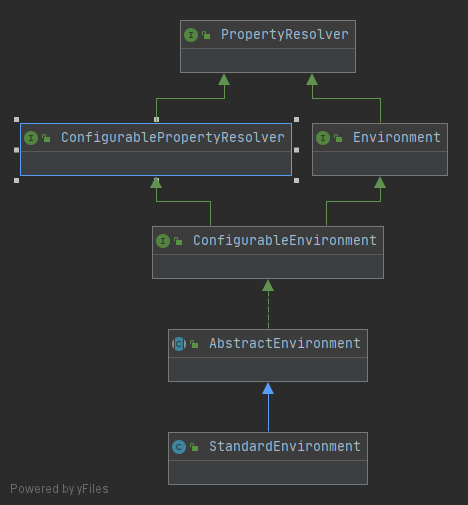

# 1.Spring容器

为什么用两个变量标识状态

```java
// 设置 关闭标识
this.closed.set(false);
// 设置 激活标识
this.active.set(true);
```


## Environment初始化





```
PropertyResolver
	能够从任意的底层数据源中解析配置的接口。
ConfigurablePropertyResolver
	内部通过设置ConfigurableConversionService帮助配置的类型转换及设置必要配置验证接口。
Environment
	应用运行环境的接口
ConfigurableEnvironment
	提供设置激活和默认的配置并且能操纵底层配置。
AbstractEnvironment
	Environment 的抽象实现，它提供一个激活配置和默认配置的机制。
```

## Bean Factory


